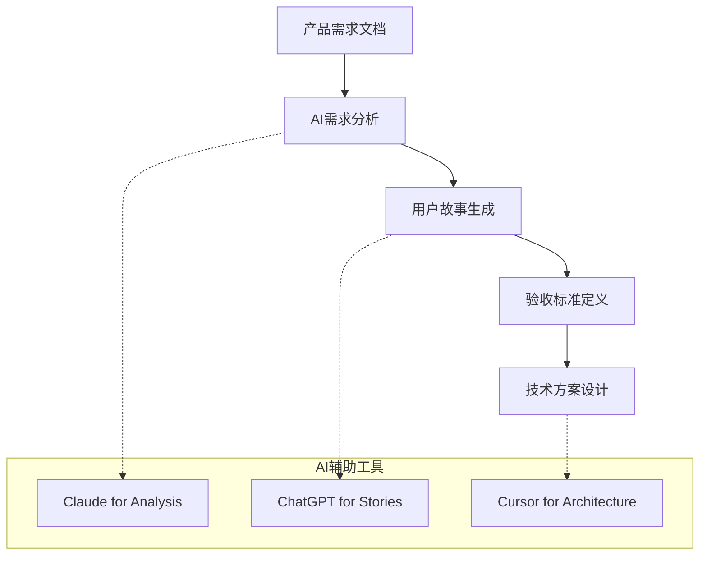
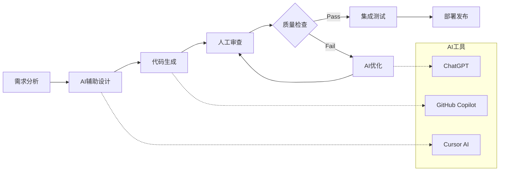

# DeepEngine平台AI辅助开发实施指南

[](#)
[](#)
[](#)

> 🤖 **指南目标**: 实现90%代码AI生成，5-10倍开发效率提升  
> 🎯 **实施策略**: Cursor AI + GitHub Copilot + 自定义提示工程  
> 📈 **目标指标**: 代码质量85%+，Bug率<5%，开发速度提升500%+

---

## 📋 AI开发工具链

### 🔧 核心工具配置

#### 1. Cursor AI配置
```typescript
// Cursor配置文件 .cursor/settings.json
{
  "ai": {
    "provider": "cursor",
    "model": "claude-3.5-sonnet",
    "temperature": 0.1,
    "maxTokens": 4000,
    "autoComplete": true,
    "chatMode": "composer",
    "contextWindow": 200000
  },
  
  "codeGeneration": {
    "language": "typescript",
    "framework": "react",
    "style": "functional",
    "testing": "jest",
    "documentation": "jsdoc"
  },
  
  "projectContext": {
    "type": "energy-management",
    "domain": "distributed-energy",
    "architecture": "microservices",
    "conventions": "airbnb-typescript"
  }
}
```

#### 2. GitHub Copilot集成
```json
// .vscode/settings.json
{
  "github.copilot.enable": {
    "*": true,
    "yaml": false,
    "plaintext": false,
    "markdown": false
  },
  
  "github.copilot.advanced": {
    "length": 500,
    "temperature": 0.1,
    "top_p": 1,
    "listCount": 3,
    "inlineSuggestEnable": true
  },
  
  "github.copilot.chat.welcomeMessage": "never"
}
```

### 🎨 提示工程模板

#### 前端组件生成提示
```typescript
// 组件生成提示模板
interface ComponentPromptTemplate {
  systemPrompt: `
    你是DeepEngine分布式能源管理平台的前端开发专家。
    
    技术栈：
    - React 18 + TypeScript 5.0
    - Tailwind CSS + Styled Components
    - Zustand + React Query
    - Recharts + D3.js
    
    设计规范：
    - 现代化能源主题UI
    - 响应式设计
    - 可访问性WCAG 2.1 AA
    - 暗色/亮色主题支持
    
    代码规范：
    - 函数式组件 + Hooks
    - TypeScript严格模式
    - ESLint + Prettier
    - 组件文档注释
  `;
  
  userPromptTemplate: `
    请为${componentType}模块创建${componentName}组件：
    
    功能需求：
    ${functionalRequirements}
    
    数据模型：
    ${dataModel}
    
    交互要求：
    ${interactionRequirements}
    
    请生成完整的组件代码，包括：
    1. TypeScript接口定义
    2. React组件实现
    3. Tailwind样式
    4. 单元测试
    5. Storybook故事
  `;
}

// 使用示例
const powerGenDashboardPrompt = `
请为PowerGen模块创建功率预测仪表盘组件：

功能需求：
- 实时功率数据展示
- 24小时功率预测曲线
- 多设备对比视图
- 预测准确度指标
- 导出功能

数据模型：
interface PowerForecastData {
  deviceId: string;
  timestamp: string;
  actualPower: number;
  predictedPower: number;
  confidence: number;
  weatherData: WeatherInfo;
}

交互要求：
- 时间范围选择器
- 设备筛选器
- 实时数据更新
- 悬停提示信息
- 缩放和平移支持
`;
```

#### 后端服务生成提示
```python
# 后端服务生成提示模板
BACKEND_SERVICE_PROMPT = """
你是DeepEngine分布式能源管理平台的后端开发专家。

技术栈：
- Python 3.11 + FastAPI
- SQLAlchemy + Alembic
- Celery + Redis
- Pydantic数据验证
- Pytest测试框架

架构规范：
- 微服务架构
- 领域驱动设计(DDD)
- CQRS + Event Sourcing
- 依赖注入容器
- 分层架构(Controller-Service-Repository)

代码规范：
- PEP 8代码风格
- Type Hints强制使用
- Docstring文档注释
- 异常处理和日志记录
- 单元测试覆盖率>90%

请为{service_name}服务创建{feature_name}功能：

业务需求：
{business_requirements}

API规范：
{api_specification}

数据模型：
{data_models}

请生成完整的服务代码，包括：
1. Pydantic模型定义
2. SQLAlchemy ORM模型
3. FastAPI路由控制器
4. 业务逻辑服务层
5. 数据访问层
6. 单元测试和集成测试
7. API文档注释
"""

# 使用示例
storage_optimization_prompt = """
请为PowerGen服务创建储能系统优化功能：

业务需求：
- 基于电价和需求预测优化充放电策略
- 支持多目标优化（成本最小化、削峰填谷、收益最大化）
- 考虑储能系统物理约束和循环寿命
- 实时调整优化策略
- 提供优化结果分析和可视化

API规范：
POST /api/v2/powergen/storage/optimize
- 请求参数：系统ID、优化周期、约束条件、目标函数
- 响应数据：优化策略、经济效益、执行计划

数据模型：
- StorageSystem: 储能系统基本信息
- OptimizationRequest: 优化请求参数
- OptimizationResult: 优化结果
- ChargingSchedule: 充放电计划
"""
```

---

## 🏗️ 开发工作流程

### 📝 AI辅助开发流程

#### 1. 需求分析阶段


```typescript
// 需求分析AI助手
interface RequirementAnalysisAI {
  // 需求理解和澄清
  analyzeRequirement: (prd: ProductRequirementDoc) => {
    userStories: UserStory[];
    acceptanceCriteria: AcceptanceCriteria[];
    technicalRequirements: TechnicalRequirement[];
    riskAssessment: RiskAssessment;
  };
  
  // 用户故事生成
  generateUserStories: (feature: FeatureDescription) => {
    stories: {
      as: string; // 用户角色
      want: string; // 功能需求
      so: string; // 业务价值
      acceptanceCriteria: string[];
      priority: "high" | "medium" | "low";
      estimation: number; // 故事点
    }[];
  };
  
  // 技术方案设计
  designTechnicalSolution: (requirements: UserStory[]) => {
    architecture: ArchitectureDesign;
    dataModels: DataModel[];
    apiDesign: APISpecification[];
    integrationPoints: IntegrationPoint[];
  };
}
```

#### 2. 代码生成阶段
```typescript
// AI代码生成工作流
class AICodeGenerationWorkflow {
  async generateFeature(userStory: UserStory): Promise<FeatureCode> {
    // 1. 生成数据模型
    const dataModels = await this.generateDataModels(userStory);
    
    // 2. 生成API接口
    const apiCode = await this.generateAPIEndpoints(userStory, dataModels);
    
    // 3. 生成业务逻辑
    const serviceCode = await this.generateBusinessLogic(userStory, dataModels);
    
    // 4. 生成前端组件
    const frontendCode = await this.generateFrontendComponents(userStory);
    
    // 5. 生成测试代码
    const testCode = await this.generateTests(userStory, {
      api: apiCode,
      service: serviceCode,
      frontend: frontendCode
    });
    
    return {
      backend: { api: apiCode, service: serviceCode },
      frontend: frontendCode,
      tests: testCode,
      documentation: await this.generateDocumentation(userStory)
    };
  }
  
  private async generateDataModels(userStory: UserStory) {
    const prompt = `
      基于用户故事生成数据模型：
      ${userStory.description}
      
      要求：
      1. Pydantic模型定义
      2. SQLAlchemy ORM模型
      3. TypeScript接口定义
      4. 数据验证规则
      5. 关系映射
    `;
    
    return await this.cursorAI.generate(prompt);
  }
}
```

#### 3. 代码审查和优化
```python
# AI代码审查工具
class AICodeReviewer:
    def __init__(self):
        self.review_criteria = {
            'code_quality': [
                '代码可读性和维护性',
                '设计模式使用是否恰当',
                'SOLID原则遵守情况',
                '代码复杂度控制'
            ],
            'security': [
                '输入验证和SQL注入防护',
                '认证和授权检查',
                '敏感数据处理',
                '错误信息泄露'
            ],
            'performance': [
                '算法复杂度分析',
                '数据库查询优化',
                '内存使用效率',
                '并发处理能力'
            ],
            'testing': [
                '测试覆盖率',
                '边界条件测试',
                '错误场景测试',
                '集成测试完整性'
            ]
        }
    
    async def review_code(self, code: str, context: CodeContext) -> ReviewResult:
        """AI辅助代码审查"""
        prompt = f"""
        请对以下代码进行全面审查，基于DeepEngine项目标准：
        
        代码：
        {code}
        
        上下文：
        - 模块：{context.module}
        - 功能：{context.feature}
        - 相关文件：{context.related_files}
        
        审查维度：
        {json.dumps(self.review_criteria, indent=2, ensure_ascii=False)}
        
        请提供：
        1. 问题清单（按严重程度分类）
        2. 改进建议
        3. 重构方案
        4. 性能优化点
        5. 安全加固建议
        """
        
        review_result = await self.ai_client.complete(prompt)
        return self.parse_review_result(review_result)
    
    def parse_review_result(self, result: str) -> ReviewResult:
        """解析AI审查结果"""
        return ReviewResult(
            critical_issues=[],
            major_issues=[],
            minor_issues=[],
            suggestions=[],
            refactoring_opportunities=[],
            performance_improvements=[],
            security_enhancements=[]
        )
```

---

## 🎯 专项AI应用场景

### 🧠 AI算法开发

#### 机器学习模型生成
```python
# AI模型生成提示模板
ML_MODEL_GENERATION_PROMPT = """
你是DeepEngine平台的AI算法专家，专注于能源预测和优化算法。

专业领域：
- 时间序列预测（LSTM、Transformer、Prophet）
- 强化学习优化（PPO、DDPG、SAC）
- 集成学习（XGBoost、LightGBM、Random Forest）
- 深度学习（PyTorch、TensorFlow）

开发规范：
- MLflow实验跟踪
- 模型版本管理
- 自动化训练管道
- 模型监控和漂移检测
- A/B测试框架

请为{prediction_task}创建预测模型：

数据特征：
{data_features}

预测目标：
{prediction_target}

性能要求：
{performance_requirements}

请生成完整的ML解决方案：
1. 数据预处理管道
2. 特征工程代码
3. 模型架构定义
4. 训练和验证脚本
5. 模型服务化代码
6. 性能评估和监控
"""

# 功率预测模型生成示例
power_forecast_prompt = """
请为光伏功率预测创建LSTM+Transformer集成模型：

数据特征：
- 历史功率数据（15分钟间隔，过去30天）
- 天气数据（温度、湿度、辐射、风速、云量）
- 时间特征（小时、星期、月份、季节）
- 设备参数（容量、效率、倾斜角、方位角）

预测目标：
- 未来24小时功率预测
- 15分钟粒度
- 置信区间估计

性能要求：
- MAPE < 3%
- 预测延迟 < 500ms
- 模型更新周期 1天
- 支持在线学习
"""

class AIPoweredMLDevelopment:
    def __init__(self):
        self.model_templates = {
            'time_series': self.generate_time_series_model,
            'optimization': self.generate_optimization_model,
            'classification': self.generate_classification_model,
            'regression': self.generate_regression_model
        }
    
    async def generate_time_series_model(self, spec: ModelSpecification):
        """生成时间序列预测模型"""
        prompt = f"""
        生成{spec.model_type}时间序列预测模型：
        
        输入特征维度：{spec.input_features}
        输出序列长度：{spec.output_length}
        预测粒度：{spec.granularity}
        
        要求：
        1. PyTorch实现
        2. 注意力机制
        3. 残差连接
        4. 批量归一化
        5. Dropout正则化
        """
        
        return await self.cursor_ai.generate_code(prompt)
    
    async def generate_optimization_model(self, spec: OptimizationSpec):
        """生成强化学习优化模型"""
        prompt = f"""
        生成{spec.algorithm}强化学习智能体：
        
        状态空间：{spec.state_space}
        动作空间：{spec.action_space}
        奖励函数：{spec.reward_function}
        
        实现要求：
        1. Stable-Baselines3框架
        2. 自定义环境
        3. 经验回放缓冲区
        4. 目标网络更新
        5. 超参数自动调优
        """
        
        return await self.cursor_ai.generate_code(prompt)
```

### 🎨 前端UI/UX开发

#### 组件库生成
```typescript
// UI组件自动生成
interface UIComponentGenerator {
  // 图表组件生成
  generateChartComponent: (chartSpec: ChartSpecification) => {
    component: ReactComponent;
    styles: TailwindStyles;
    types: TypeDefinitions;
    tests: TestSuite;
    stories: StorybookStories;
  };
  
  // 表单组件生成
  generateFormComponent: (formSpec: FormSpecification) => {
    component: ReactComponent;
    validation: ValidationSchema;
    hooks: CustomHooks;
    types: TypeDefinitions;
  };
  
  // 仪表盘生成
  generateDashboard: (dashboardSpec: DashboardSpecification) => {
    layout: DashboardLayout;
    widgets: Widget[];
    dataConnectors: DataConnector[];
    customization: CustomizationOptions;
  };
}

// 能源仪表盘生成提示
const ENERGY_DASHBOARD_PROMPT = `
请生成DeepEngine能源管理仪表盘组件：

设计要求：
- 现代化暗色主题
- 响应式网格布局
- 实时数据可视化
- 交互式图表
- 数据导出功能

功能模块：
1. 实时功率监控
2. 发电量统计
3. 预测准确度分析
4. 收益分析图表
5. 设备状态面板
6. 告警通知中心

技术规范：
- React 18 + TypeScript
- Tailwind CSS
- Recharts图表库
- React Query数据管理
- Framer Motion动画

请生成：
1. 仪表盘主组件
2. 子组件（图表、指标卡片、状态面板）
3. 数据获取Hooks
4. 样式定义
5. 响应式布局
6. 单元测试
`;
```

### 🧪 测试代码生成

#### 自动化测试生成
```python
# 测试代码生成引擎
class AITestGenerator:
    def __init__(self):
        self.test_types = {
            'unit': self.generate_unit_tests,
            'integration': self.generate_integration_tests,
            'e2e': self.generate_e2e_tests,
            'performance': self.generate_performance_tests,
            'security': self.generate_security_tests
        }
    
    async def generate_comprehensive_tests(self, code: str, context: TestContext):
        """生成全面的测试套件"""
        prompt = f"""
        为以下代码生成完整的测试套件：
        
        代码：
        {code}
        
        上下文：
        - 模块类型：{context.module_type}
        - 业务场景：{context.business_scenario}
        - 依赖项：{context.dependencies}
        
        测试要求：
        1. 单元测试（正常场景、边界条件、异常处理）
        2. 集成测试（API测试、数据库测试）
        3. 性能测试（负载测试、压力测试）
        4. 安全测试（认证、授权、输入验证）
        
        测试框架：
        - Python: pytest + pytest-asyncio
        - JavaScript: Jest + Testing Library
        - API: FastAPI TestClient
        
        覆盖率目标：>90%
        """
        
        return await self.ai_client.generate_tests(prompt)
    
    def generate_test_data(self, model: DataModel) -> TestDataSet:
        """生成测试数据"""
        prompt = f"""
        为数据模型生成测试数据集：
        
        模型定义：
        {model.schema}
        
        要求：
        1. 正常数据（各种有效值组合）
        2. 边界数据（最大值、最小值、临界值）
        3. 异常数据（无效值、缺失值、格式错误）
        4. 性能测试数据（大数据集）
        
        格式：JSON + SQL + CSV
        """
        
        return self.ai_client.generate_test_data(prompt)
```

---

## 📊 AI开发效率监控

### 📈 效率指标跟踪

#### 开发效率度量
```typescript
// AI开发效率监控系统
interface AIDevEfficiencyMetrics {
  codeGeneration: {
    aiGeneratedLines: number;
    humanWrittenLines: number;
    aiGenerationRate: number; // %
    codeAcceptanceRate: number; // %
    generationTime: number; // seconds
  };
  
  qualityMetrics: {
    bugRate: number; // bugs per 1000 lines
    codeReviewCycles: number;
    testCoverage: number; // %
    performanceScore: number; // 1-10
    maintainabilityIndex: number; // 1-100
  };
  
  productivityMetrics: {
    featuresPerSprint: number;
    timeToMarket: number; // days
    developerSatisfaction: number; // 1-10
    learningCurve: number; // days to proficiency
  };
  
  costEfficiency: {
    developmentCostReduction: number; // %
    maintenanceCostSaving: number; // %
    trainingTimeReduction: number; // %
    qualityImprovementROI: number; // %
  };
}

class AIDevEfficiencyTracker {
  async trackDailyMetrics(): Promise<DailyMetrics> {
    // 收集AI辅助开发数据
    const aiStats = await this.collectAIUsageStats();
    const codeStats = await this.collectCodeStats();
    const qualityStats = await this.collectQualityStats();
    
    return {
      date: new Date().toISOString(),
      aiUsage: aiStats,
      codeMetrics: codeStats,
      qualityMetrics: qualityStats,
      efficiency: this.calculateEfficiencyScore({
        aiStats,
        codeStats,
        qualityStats
      })
    };
  }
  
  generateEfficiencyReport(): EfficiencyReport {
    return {
      summary: "AI辅助开发效率报告",
      period: "过去30天",
      keyMetrics: {
        aiCodeGeneration: "92%", // 代码AI生成率
        developmentSpeedUp: "6.2x", // 开发速度提升
        bugRateReduction: "73%", // Bug率降低
        developerSatisfaction: "9.1/10" // 开发者满意度
      },
      improvements: [
        "AI提示工程优化建议",
        "代码质量进一步提升方案",
        "开发流程改进建议",
        "团队技能提升计划"
      ]
    };
  }
}
```

### 🎯 持续优化策略

#### AI提示优化
```python
# AI提示工程优化
class PromptOptimizer:
    def __init__(self):
        self.optimization_strategies = [
            'context_enrichment',  # 上下文丰富化
            'example_driven',      # 示例驱动
            'step_by_step',       # 分步引导
            'constraint_definition', # 约束明确化
            'output_formatting'    # 输出格式化
        ]
    
    def optimize_prompt(self, base_prompt: str, task_type: str) -> OptimizedPrompt:
        """优化AI提示"""
        optimizations = {
            'context_enrichment': self.add_domain_context,
            'example_driven': self.add_examples,
            'step_by_step': self.add_step_guidance,
            'constraint_definition': self.add_constraints,
            'output_formatting': self.add_format_spec
        }
        
        optimized = base_prompt
        for strategy in self.optimization_strategies:
            optimized = optimizations[strategy](optimized, task_type)
        
        return OptimizedPrompt(
            original=base_prompt,
            optimized=optimized,
            improvements=self.analyze_improvements(base_prompt, optimized)
        )
    
    def add_domain_context(self, prompt: str, task_type: str) -> str:
        """添加领域上下文"""
        domain_context = {
            'frontend': """
            DeepEngine是分布式能源管理平台，用户主要是：
            1. 发电侧：分布式能源运营商
            2. 用电侧：工商业用户
            3. 电网侧：电网企业和售电公司
            
            UI设计风格：现代化、专业、数据驱动
            """,
            'backend': """
            DeepEngine平台处理大量实时能源数据：
            1. 设备数据：功率、电量、状态等
            2. 市场数据：电价、需求等
            3. 天气数据：辐射、温度、风速等
            
            性能要求：高并发、低延迟、高可用
            """,
            'ai_algorithm': """
            DeepEngine的AI算法主要用于：
            1. 发电功率预测（光伏、风电）
            2. 负荷预测和优化
            3. 储能系统优化
            4. 市场交易策略
            
            准确性要求：预测MAPE < 3%
            """
        }
        
        return f"{domain_context.get(task_type, '')}\n\n{prompt}"
```

---

## 🔄 AI开发最佳实践

### ✅ 开发规范清单

#### 1. AI提示工程规范
```markdown
## AI提示工程最佳实践

### 🎯 提示结构
1. **角色定义**: 明确AI的专业角色和技能
2. **上下文设置**: 提供充分的业务和技术背景
3. **任务描述**: 清晰具体的任务要求
4. **约束条件**: 明确限制和标准
5. **输出格式**: 指定期望的输出结构

### 📝 提示模板
```
你是{专业角色}，专注于{专业领域}。

背景信息：
{项目背景和技术栈}

任务要求：
{具体任务描述}

技术规范：
{编码标准和架构要求}

输出要求：
{期望的代码结构和文档}
```

### 🔍 质量检查
- [ ] 提示是否包含充分的上下文
- [ ] 任务描述是否清晰具体
- [ ] 技术要求是否明确
- [ ] 输出格式是否标准化
- [ ] 是否包含错误处理要求
```

#### 2. 代码质量保障
```typescript
// AI生成代码质量检查
interface CodeQualityStandards {
  structure: {
    modular: "代码模块化，职责单一";
    readable: "命名清晰，注释完善";
    testable: "易于测试，依赖可注入";
    maintainable: "结构清晰，易于维护";
  };
  
  security: {
    inputValidation: "输入验证和清理";
    authorizationCheck: "权限检查";
    errorHandling: "安全的错误处理";
    dataProtection: "敏感数据保护";
  };
  
  performance: {
    algorithmicEfficiency: "算法复杂度优化";
    memoryManagement: "内存使用优化";
    concurrency: "并发处理能力";
    caching: "适当的缓存策略";
  };
  
  documentation: {
    codeComments: "关键逻辑注释";
    apiDocumentation: "API文档完整";
    usageExamples: "使用示例";
    troubleshooting: "故障排除指南";
  };
}
```

#### 3. 协作开发流程


---

## 📚 学习资源和培训

### 🎓 AI开发技能培训

#### 团队培训计划
```typescript
interface AIDevTrainingPlan {
  phase1_fundamentals: {
    duration: "2周";
    topics: [
      "AI辅助开发基础概念",
      "Cursor AI工具使用",
      "GitHub Copilot最佳实践",
      "提示工程入门"
    ];
    outcomes: "掌握基本AI开发工具";
  };
  
  phase2_advanced: {
    duration: "3周";
    topics: [
      "高级提示工程技巧",
      "代码生成质量优化",
      "AI模型选择和配置",
      "团队协作流程"
    ];
    outcomes: "熟练应用AI开发技术";
  };
  
  phase3_specialization: {
    duration: "4周";
    topics: [
      "领域特定AI应用",
      "自定义AI工具开发",
      "AI开发效率优化",
      "质量保障体系"
    ];
    outcomes: "成为AI开发专家";
  };
  
  ongoing_learning: {
    frequency: "每周";
    activities: [
      "AI技术趋势分享",
      "最佳实践案例研讨",
      "工具和技巧交流",
      "项目经验总结"
    ];
  };
}
```

### 📖 参考资源

#### 官方文档和工具
- [Cursor AI官方文档](https://cursor.sh/docs)
- [GitHub Copilot最佳实践](https://docs.github.com/copilot)
- [OpenAI API使用指南](https://platform.openai.com/docs)
- [Claude API文档](https://docs.anthropic.com)

#### 社区资源
- [AI开发者社区论坛](https://dev.to/t/ai)
- [Prompt Engineering指南](https://promptengineering.org)
- [AI代码质量检查工具](https://deepsource.io)

---

**文档版本**: v1.0  
**创建日期**: 2024-12-29  
**AI开发专家**: DeepEngine技术组  
**审核状态**: 待Review

> 🚀 **持续进化**: AI辅助开发技术快速发展，本指南将持续更新最新最佳实践和工具技巧。 