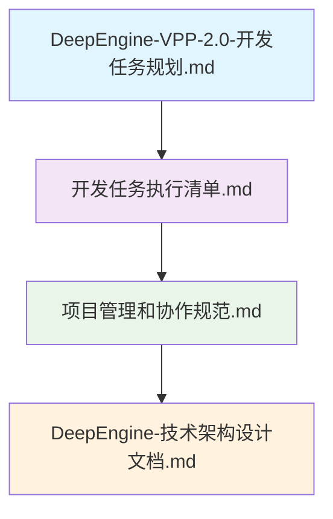
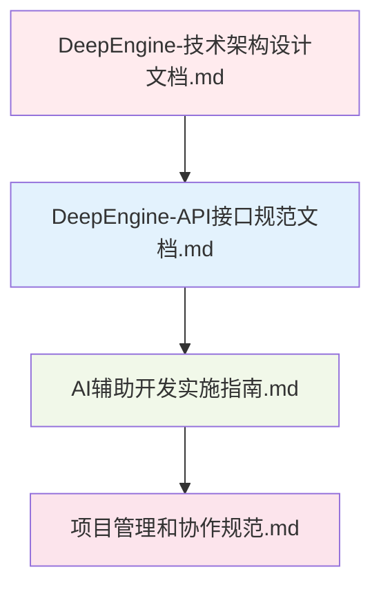
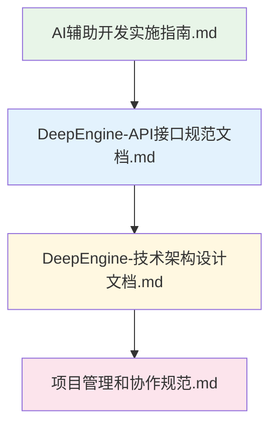
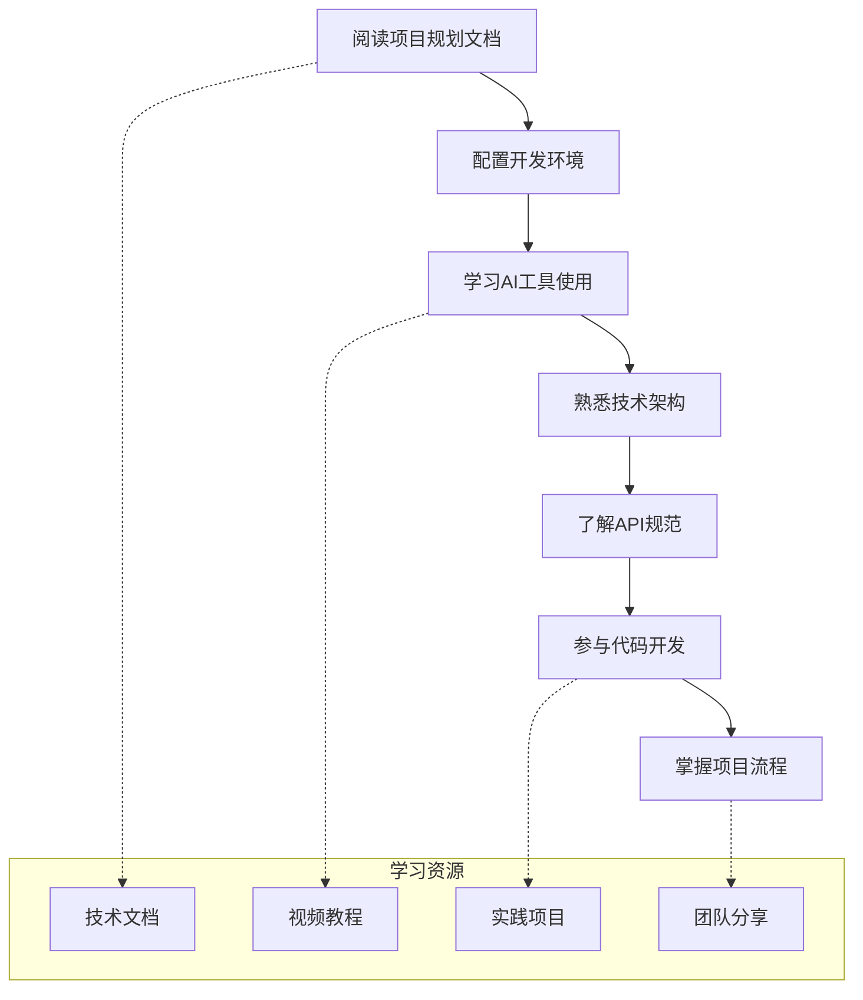

# DeepEngine分布式能源平台项目文档汇总

[](#)
[](#)
[](#)

> 📚 **文档目标**: 提供完整的DeepEngine项目开发指导文档体系  
> 🎯 **覆盖范围**: 从需求分析到部署上线的全生命周期  
> ⚡ **使用指南**: AI驱动的2-10倍开发效率提升实施方案

---

## 📋 文档体系概览

### 🎯 核心规划文档

#### 1. 战略规划层
| 文档名称 | 文件路径 | 主要内容 | 完成状态 |
|---------|----------|----------|----------|
| **总体开发规划** | `DeepEngine-VPP-2.0-开发任务规划.md` | 项目愿景、技术路线图、里程碑规划 | ✅ 完成 |
| **执行清单** | `开发任务执行清单.md` | 详细任务分解、时间安排、责任分工 | ✅ 完成 |

#### 2. 技术架构层
| 文档名称 | 文件路径 | 主要内容 | 完成状态 |
|---------|----------|----------|----------|
| **技术架构设计** | `DeepEngine-技术架构设计文档.md` | 系统架构、技术选型、部署方案 | ✅ 完成 |
| **API接口规范** | `DeepEngine-API接口规范文档.md` | RESTful API设计、数据模型、错误处理 | ✅ 完成 |

#### 3. 开发实施层
| 文档名称 | 文件路径 | 主要内容 | 完成状态 |
|---------|----------|----------|----------|
| **AI辅助开发指南** | `AI辅助开发实施指南.md` | AI工具使用、提示工程、开发流程 | ✅ 完成 |
| **项目管理规范** | `项目管理和协作规范.md` | 敏捷开发、团队协作、质量保障 | ✅ 完成 |

---

## 🚀 项目启动指南

### 📖 文档阅读顺序

#### 对于项目管理者


1. **[DeepEngine-VPP-2.0-开发任务规划.md](./DeepEngine-VPP-2.0-开发任务规划.md)**
   - 📋 了解项目整体规划和战略目标
   - 🎯 掌握技术路线图和里程碑安排
   - 💡 理解AI原生开发策略

2. **[开发任务执行清单.md](./开发任务执行清单.md)**
   - ✅ 获取详细的任务分解和时间安排
   - 👥 明确团队角色和责任分工
   - 📊 建立项目跟踪和质量控制机制

3. **[项目管理和协作规范.md](./项目管理和协作规范.md)**
   - 🤝 掌握敏捷开发流程和团队协作方式
   - 🔄 建立高效的工作流程和沟通机制
   - 📈 设置项目监控和报告体系

#### 对于技术负责人


1. **[DeepEngine-技术架构设计文档.md](./DeepEngine-技术架构设计文档.md)**
   - 🏗️ 理解系统整体架构和设计理念
   - 🔧 掌握技术栈选择和部署策略
   - 📈 了解扩展性和性能要求

2. **[DeepEngine-API接口规范文档.md](./DeepEngine-API接口规范文档.md)**
   - 🔗 掌握完整的API设计规范
   - 📝 理解数据模型和接口定义
   - 🔐 了解安全机制和错误处理

3. **[AI辅助开发实施指南.md](./AI辅助开发实施指南.md)**
   - 🤖 学习AI工具的高效使用方法
   - 🎯 掌握提示工程和代码生成技巧
   - 📊 建立AI开发效率监控体系

#### 对于开发团队


1. **[AI辅助开发实施指南.md](./AI辅助开发实施指南.md)**
   - 🛠️ 快速上手Cursor AI等开发工具
   - 💡 学习提示工程最佳实践
   - 🚀 实现5-10倍开发效率提升

2. **[DeepEngine-API接口规范文档.md](./DeepEngine-API接口规范文档.md)**
   - 📡 理解API设计标准和使用方法
   - 🔍 查阅具体接口定义和示例代码
   - 🧪 掌握测试和调试技巧

3. **[DeepEngine-技术架构设计文档.md](./DeepEngine-技术架构设计文档.md)**
   - 🎯 了解模块架构和设计模式
   - 🔧 掌握开发环境和工具配置
   - 📋 理解编码规范和质量要求

---

## 📊 项目概况总览

### 🎯 项目核心信息

```typescript
// 项目基本信息
interface ProjectOverview {
  projectName: "DeepEngine分布式能源产业链整合平台";
  version: "2.0";
  developmentPeriod: "12个月 (2024年1月 - 2024年12月)";
  
  coreModules: [
    "PowerGen智能发电管理系统",
    "SmartLoad智慧用能管理系统", 
    "VPPCloud虚拟电厂运营平台"
  ];
  
  technicalHighlights: {
    aiNativeDevelopment: "90%代码AI生成";
    efficiencyImprovement: "5-10倍开发速度提升";
    performanceTargets: "API响应<2s, 99.95%可用性";
    scalabilityGoals: "支持10万+设备接入";
  };
  
  marketPosition: {
    targetMarket: "中国分布式能源市场";
    marketSize: "2027年超过8000亿元";
    vppMarketSize: "2030年达到1500亿元";
  };
}
```

### 📈 开发里程碑

#### Phase 1: MVP版本 (1-3个月)
```yaml
mvp_phase:
  duration: "3个月"
  target_users: "50个试点客户"
  core_features:
    - "PowerGen基础功能"
    - "SmartLoad负荷监控"
    - "AI功率预测算法"
    - "Web管理平台"
  success_metrics:
    - "功能完成度: 100%"
    - "用户满意度: >8分"
    - "API响应时间: <2秒"
    - "系统可用性: >99%"
```

#### Phase 2: 专业版 (4-6个月)
```yaml
professional_phase:
  duration: "3个月"
  target_users: "200个企业客户"
  advanced_features:
    - "VPPCloud虚拟电厂"
    - "移动端应用"
    - "高级AI算法"
    - "企业级安全"
  business_goals:
    - "收入增长: 20-40%"
    - "成本降低: 15-35%"
    - "设备支持: 1万+"
    - "商业化就绪: 100%"
```

#### Phase 3: 企业版 (7-12个月)
```yaml
enterprise_phase:
  duration: "6个月"
  target_users: "1000个大型客户"
  enterprise_features:
    - "边缘计算支持"
    - "区块链集成"
    - "生态合作伙伴平台"
    - "国际化支持"
  ecosystem_goals:
    - "合作伙伴: 10+"
    - "国际部署: 多区域"
    - "生态价值: 平台化"
    - "技术领先: 行业标杆"
```

---

## 🛠️ 技术栈概览

### 💻 前端技术栈
```typescript
// 前端技术架构
interface FrontendTechStack {
  framework: "React 18.2 + TypeScript 5.0";
  styling: "Tailwind CSS 3.x + Styled Components";
  stateManagement: "Zustand + React Query";
  dataVisualization: "Recharts + D3.js";
  mobile: "React Native 0.72+";
  testing: "Jest + Testing Library + Playwright";
  buildTools: "Vite + ESBuild";
  aiIntegration: "Cursor AI + GitHub Copilot";
}
```

### ⚙️ 后端技术栈
```python
# 后端技术架构
class BackendTechStack:
    languages = ["Python 3.11+", "Java 17+", "Node.js 18+"]
    frameworks = ["FastAPI", "Spring Boot", "Express.js"]
    databases = {
        'relational': "PostgreSQL 15+",
        'time_series': "InfluxDB 2.x", 
        'cache': "Redis 7.x",
        'document': "MongoDB 6.x"
    }
    messaging = ["Apache Kafka", "RabbitMQ"]
    containerization = ["Docker", "Kubernetes 1.28+"]
    monitoring = ["Prometheus", "Grafana", "ELK Stack"]
    ai_frameworks = ["PyTorch", "TensorFlow", "Scikit-learn"]
```

### 🧠 AI算法栈
```python
# AI算法技术栈
class AIAlgorithmStack:
    prediction_models = [
        "LSTM时间序列预测",
        "Transformer深度学习",
        "LightGBM梯度提升",
        "Prophet季节性预测"
    ]
    
    optimization_algorithms = [
        "深度强化学习(PPO/DDPG)",
        "遗传算法优化",
        "粒子群优化算法",
        "多目标优化算法"
    ]
    
    serving_infrastructure = [
        "TensorFlow Serving",
        "MLflow模型管理",
        "ONNX Runtime推理",
        "Kubeflow ML流水线"
    ]
```

---

## 🚀 快速启动步骤

### 🔧 环境准备

#### 1. 开发工具安装
```bash
# AI开发工具
## Cursor AI (主要IDE)
curl -fsSL https://cursor.sh/install.sh | sh

## Node.js和Python环境
brew install node python@3.11

## Docker和Kubernetes
brew install docker kubernetes-cli

# 项目依赖安装
npm install -g pnpm
pip install poetry
```

#### 2. 项目初始化
```bash
# 克隆项目模板
git clone https://github.com/deepengine/vpp-2.0-template
cd vpp-2.0-template

# 前端项目初始化
cd frontend
pnpm install
pnpm dev

# 后端项目初始化
cd ../backend
poetry install
poetry run uvicorn main:app --reload

# AI算法项目初始化
cd ../ai-algorithms
pip install -r requirements.txt
python -m pytest tests/
```

#### 3. AI工具配置
```json
// .cursor/settings.json
{
  "ai.provider": "cursor",
  "ai.model": "claude-3.5-sonnet",
  "ai.autoComplete": true,
  "ai.chatMode": "composer",
  "project.domain": "distributed-energy",
  "project.architecture": "microservices",
  "project.style": "deepengine-conventions"
}
```

### 📚 学习路径

#### 新团队成员上手指南


#### 阶段性学习目标
```yaml
week1_foundations:
  goals: ["理解项目愿景", "配置开发环境", "掌握基础AI工具"]
  deliverables: ["环境搭建完成", "第一个AI生成组件"]
  
week2_architecture:
  goals: ["熟悉系统架构", "掌握API设计", "理解数据模型"]
  deliverables: ["架构图理解", "API调用测试"]
  
week3_development:
  goals: ["参与功能开发", "代码审查参与", "测试编写"]
  deliverables: ["第一个功能模块", "代码审查通过"]
  
week4_mastery:
  goals: ["独立开发能力", "AI工具熟练", "团队协作"]
  deliverables: ["独立完成需求", "指导新人"]
```

---

## 📞 支持和联系

### 🤝 团队联系方式

#### 核心团队
```yaml
team_contacts:
  project_manager:
    role: "项目经理"
    email: "pm@deepengine.com"
    responsibilities: ["项目规划", "进度管理", "风险控制"]
    
  tech_lead:
    role: "技术负责人"
    email: "tech@deepengine.com"
    responsibilities: ["技术架构", "代码审查", "技术决策"]
    
  ai_lead:
    role: "AI算法负责人"
    email: "ai@deepengine.com"
    responsibilities: ["算法设计", "模型优化", "AI工具指导"]
    
  product_owner:
    role: "产品负责人"
    email: "product@deepengine.com"
    responsibilities: ["需求管理", "用户体验", "产品规划"]
```

#### 沟通渠道
```typescript
// 团队沟通方式
interface CommunicationChannels {
  daily: {
    standup: "每日9:00晨会";
    slack: "#deepengine-dev频道";
    email: "日常工作邮件";
  };
  
  weekly: {
    review: "每周五下午review会议";
    planning: "每周一上午planning会议";
    retrospective: "每两周一次回顾会议";
  };
  
  emergency: {
    phone: "紧急事项电话联系";
    slack_dm: "Slack私信";
    escalation: "升级机制";
  };
}
```

### 📖 文档更新机制

#### 文档维护责任
```yaml
documentation_ownership:
  strategic_planning:
    owner: "项目经理"
    update_frequency: "月度更新"
    review_cycle: "季度评审"
    
  technical_architecture:
    owner: "技术负责人"
    update_frequency: "双周更新"
    review_cycle: "月度评审"
    
  api_specifications:
    owner: "后端团队负责人"
    update_frequency: "每Sprint更新"
    review_cycle: "实时更新"
    
  ai_development_guide:
    owner: "AI工程师"
    update_frequency: "周度更新"
    review_cycle: "持续改进"
```

---

## 🎯 成功指标

### 📊 项目成功指标

#### 技术指标
```typescript
// 技术成功指标
interface TechnicalSuccessMetrics {
  development: {
    aiCodeGeneration: ">90%";
    developmentSpeed: "5-10x提升";
    codeQuality: "A级评分";
    testCoverage: ">90%";
  };
  
  performance: {
    apiResponseTime: "<2秒";
    systemAvailability: ">99.95%";
    throughput: ">10000 RPS";
    errorRate: "<0.1%";
  };
  
  scalability: {
    deviceSupport: ">10万设备";
    concurrentUsers: ">1万用户";
    dataProcessing: ">100万数据点/秒";
    multiRegion: "支持多区域部署";
  };
}
```

#### 业务指标
```yaml
business_success_metrics:
  customer_satisfaction:
    user_satisfaction: ">9分/10分"
    feature_adoption: ">80%"
    customer_retention: ">95%"
    nps_score: ">70"
    
  business_impact:
    revenue_increase: "20-40%"
    cost_reduction: "15-35%"
    efficiency_improvement: "30-50%"
    market_penetration: "行业前3名"
    
  team_satisfaction:
    developer_happiness: ">9分/10分"
    learning_growth: "技能提升明显"
    work_life_balance: "健康平衡"
    career_development: "清晰发展路径"
```

---

**文档汇总版本**: v1.0  
**创建日期**: 2024-12-29  
**负责团队**: DeepEngine全体成员  
**审核状态**: Ready for Launch 🚀

> 🌟 **项目启航**: 所有文档已完成，团队准备就绪，DeepEngine项目正式启动！期待创造分布式能源管理的技术奇迹！ 