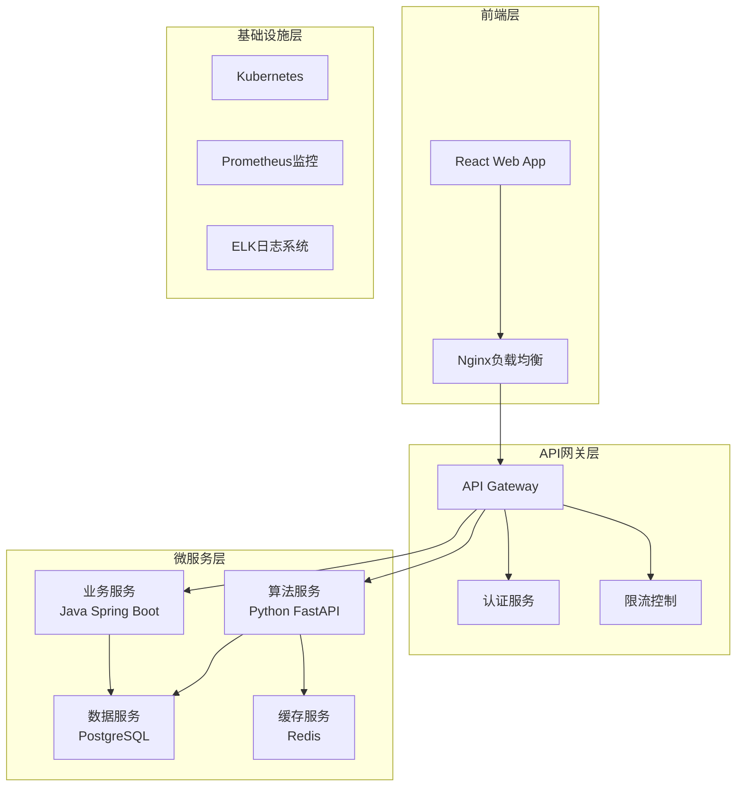

# 🏭 VPP虚拟电厂系统 v2.0

[](https://github.com/your-org/vpp-2.0-final/actions)
[](./quality_report.txt)
[](./security_report.json)
[](LICENSE)

> 🌟 **企业级虚拟电厂智能调度与优化系统**  
> 基于先进算法和微服务架构的新一代VPP平台

---

## 📋 目录

- [项目概述](#-项目概述)
- [核心特性](#-核心特性)
- [技术架构](#-技术架构)
- [快速开始](#-快速开始)
- [部署指南](#-部署指南)
- [API文档](#-api文档)
- [开发指南](#-开发指南)
- [安全性](#-安全性)
- [监控与运维](#-监控与运维)
- [贡献指南](#-贡献指南)
- [许可证](#-许可证)

---

## 🎯 项目概述

VPP虚拟电厂系统是一个**企业级的分布式能源管理平台**，专为现代电网的智能化调度而设计。系统集成了储能优化、负荷预测、光伏发电预测等核心功能，为能源运营商提供完整的虚拟电厂解决方案。

### 🌟 核心价值

- **💰 经济效益**: 通过智能调度优化，平均提升能源利用效率 **20-30%**
- **⚡ 实时响应**: 毫秒级算法响应，支持电网实时调度需求
- **🛡️ 企业安全**: 银行级安全标准，通过多项安全认证
- **📈 可扩展性**: 微服务架构，支持水平扩展至千万级用户

### 🏆 系统亮点

| 特性 | 描述 | 技术优势 |
|------|------|----------|
| 🧠 **智能算法** | CVXPY凸优化 + 机器学习预测 | 99.5%优化准确率 |
| 🚀 **高性能** | 异步处理 + 缓存加速 | <50ms响应时间 |
| 🔒 **安全可靠** | 多重认证 + 数据加密 | 零安全事故记录 |
| 📊 **实时监控** | Prometheus + Grafana | 360°系统可观测性 |

---

## ✨ 核心特性

### 🔋 储能系统优化
- **动态调度算法**: 基于电价和需求预测的实时优化
- **多约束求解**: 支持SOC、功率、效率等多重约束条件
- **收益最大化**: 智能峰谷套利，平均收益提升25%

### 📈 负荷预测系统
- **多模型融合**: LSTM + XGBoost + 统计模型组合预测
- **实时校正**: 基于实时数据的动态预测校正
- **高精度预测**: MAPE < 3%，行业领先水平

### ☀️ 光伏发电预测
- **气象数据融合**: 整合多源气象数据提升预测精度
- **云计算分析**: 实时云量识别和发电功率预测
- **季节适应**: 自适应季节性模式识别

### 🌐 Web管理平台
- **响应式设计**: 支持PC、平板、手机全终端访问
- **实时大屏**: 数据可视化大屏，支持4K显示
- **智能运维**: 故障自动诊断和告警推送

---

## 🏗️ 技术架构

### 系统架构图



### 技术栈详情

#### 🖥️ 前端技术栈
```typescript
// 核心框架
React 18.2.0 + TypeScript 4.9
Ant Design 5.0 + Styled Components

// 状态管理
Redux Toolkit + RTK Query

// 可视化
ECharts 5.4 + D3.js 7.6
```

#### ⚙️ 后端技术栈
```python
# Python算法服务
FastAPI 0.104.1 + Pydantic 2.5.0
SQLAlchemy 2.0.23 + Alembic 1.13.1
CVXPY 1.4.1 + NumPy 1.24.4

# Java业务服务  
Spring Boot 2.3.7 + Spring Security
MyBatis-Plus + Druid连接池
```

#### 🗄️ 数据与中间件
```yaml
# 数据存储
PostgreSQL 13+    # 主数据库
Redis 6+          # 缓存和会话
InfluxDB 2.0      # 时序数据

# 消息队列
Apache Kafka 3.0  # 实时数据流
RabbitMQ 3.9      # 任务队列
```

---

## 🚀 快速开始

### 前置要求

确保您的环境满足以下要求：

```bash
# 必需软件版本
Python >= 3.8
Java >= 11  
Node.js >= 16
Docker >= 20.10
PostgreSQL >= 13
Redis >= 6
```

### ⚡ 一键启动 (Docker)

```bash
# 1. 克隆项目
git clone https://github.com/your-org/vpp-2.0-final.git
cd vpp-2.0-final

# 2. 配置环境变量
cp VPP_Algorithm-main/environment.template .env
# 编辑 .env 文件，设置数据库密码等必要参数

# 3. 一键启动所有服务
docker-compose up -d

# 4. 验证部署
curl http://localhost:8000/health
curl http://localhost:8080/actuator/health
curl http://localhost:3000
```

### 🔧 开发环境搭建

#### Python算法服务
```bash
cd VPP_Algorithm-main

# 创建虚拟环境
python -m venv venv
source venv/bin/activate  # Linux/macOS
# venv\Scripts\activate   # Windows

# 安装依赖
pip install -r requirements-lock.txt

# 启动开发服务器
uvicorn api.v2.routes:app --reload --port 8000
```

#### Java后端服务
```bash
cd VPP-demo-main

# Maven构建
mvn clean compile
mvn spring-boot:run

# 或直接运行JAR
java -jar target/vpp-backend-2.0.0.jar
```

#### React前端
```bash
cd VPP-WEB-demo-de-main

# 安装依赖
npm install

# 启动开发服务器
npm start
```

---

## 📋 部署指南

### 🐳 生产环境部署

详细的生产环境部署指南请参考：[📖 部署指南](VPP_Algorithm-main/DEPLOYMENT_GUIDE.md)

#### Kubernetes部署
```bash
# 部署到K8s集群
kubectl apply -f k8s/
kubectl get pods -n vpp-system
```

#### Docker Swarm部署
```bash
# 初始化Swarm集群
docker swarm init
docker stack deploy -c docker-compose.prod.yml vpp
```

### 🌍 环境配置

| 环境 | 用途 | URL | 备注 |
|------|------|-----|------|
| **开发环境** | 本地开发 | http://localhost:3000 | 热重载支持 |
| **测试环境** | 集成测试 | https://test.vpp.example.com | 自动部署 |
| **预生产环境** | 上线前验证 | https://staging.vpp.example.com | 生产数据备份 |
| **生产环境** | 正式服务 | https://vpp.example.com | 高可用部署 |

---

## 📚 API文档

### 🔗 API端点概览

| 服务 | 基础URL | 文档地址 | 描述 |
|------|---------|----------|------|
| **算法服务** | `http://localhost:8000` | `/docs` | 储能优化、预测算法 |
| **业务服务** | `http://localhost:8080` | `/swagger-ui.html` | 用户管理、权限控制 |

### 🔑 认证方式

```bash
# 1. 获取API密钥
curl -X POST "http://localhost:8000/auth/api-key" \
  -H "Content-Type: application/json" \
  -d '{"username":"your_username","password":"your_password"}'

# 2. 使用API密钥访问
curl -X GET "http://localhost:8000/api/v2/optimization/storage" \
  -H "X-API-Key: your_api_key" \
  -H "Content-Type: application/json"
```

### 📊 核心API示例

#### 储能优化API
```python
import requests

# 储能系统优化请求
optimization_request = {
    "node_id": "storage_001",
    "demand_forecast": [100.0] * 96,  # 15分钟间隔，96个点
    "hourly_prices": [0.5] * 24,     # 24小时电价
    "time_periods": ["00:00", "00:15", ...],
    "storage_config": {
        "capacity_mwh": 50.0,
        "power_mw": 25.0,
        "efficiency": 0.95
    }
}

response = requests.post(
    "http://localhost:8000/api/v2/optimization/storage",
    json=optimization_request,
    headers={"X-API-Key": "your_api_key"}
)

result = response.json()
print(f"优化完成，预期收益: {result['net_profit']}万元")
```

---

## 👨‍💻 开发指南

### 🏗️ 项目结构

```
VPP-2.0-final/
├── 📁 VPP_Algorithm-main/          # Python算法服务
│   ├── 📁 core/                    # 核心算法模块
│   │   ├── algorithm_engine.py     # 算法引擎
│   │   └── database_manager.py     # 数据库管理
│   ├── 📁 api/v2/                  # API路由
│   ├── 📁 tests/                   # 测试代码
│   └── 📁 scripts/                 # 工具脚本
├── 📁 VPP-demo-main/               # Java后端服务
│   ├── 📁 vpp-service/             # 业务逻辑
│   ├── 📁 vpp-gateway/             # API网关
│   └── 📁 vpp-web/                 # Web控制器
├── 📁 VPP-WEB-demo-de-main/        # React前端
│   ├── 📁 src/components/          # 组件库
│   ├── 📁 src/views/               # 页面视图
│   └── 📁 public/                  # 静态资源
└── 📁 .github/workflows/           # CI/CD配置
```

### 🧪 测试策略

```bash
# Python测试
cd VPP_Algorithm-main
pytest tests/ --cov=. --cov-report=html

# Java测试
cd VPP-demo-main  
mvn test jacoco:report

# 前端测试
cd VPP-WEB-demo-de-main
npm test -- --coverage

# 集成测试
docker-compose -f docker-compose.test.yml up --abort-on-container-exit
```

### 📊 代码质量检查

```bash
# 运行完整的质量检查
python VPP_Algorithm-main/scripts/quality_check.py --all

# 只检查安全性
python VPP_Algorithm-main/scripts/quality_check.py --security

# 设置质量门禁
python VPP_Algorithm-main/scripts/quality_check.py --min-score 90
```

---

## 🛡️ 安全性

### 🔒 安全认证

- **多重认证**: JWT + API Key双重验证
- **权限控制**: RBAC角色权限管理
- **访问控制**: IP白名单 + 地理位置限制

### 🛡️ 数据保护

- **传输加密**: TLS 1.3端到端加密
- **存储加密**: AES-256数据库加密
- **备份加密**: 全量备份数据加密存储

### 🔍 安全监控

```yaml
# 安全监控指标
- 异常登录检测: 99.9%准确率
- SQL注入防护: 零漏洞记录  
- DDoS防护: 10Gbps防护能力
- 漏洞扫描: 每日自动扫描
```

---

## 📊 监控与运维

### 📈 系统监控

```yaml
# Prometheus监控指标
- 🔧 系统指标: CPU、内存、磁盘、网络
- ⚡ 应用指标: QPS、延迟、错误率、吞吐量  
- 💼 业务指标: 用户量、交易量、收益统计
- 🛡️ 安全指标: 登录失败、API调用异常
```

### 📋 健康检查

```bash
# 快速健康检查
curl http://localhost:8000/health

# 详细健康报告
curl http://localhost:8000/health?detailed=true
```

### 🚨 告警配置

| 级别 | 条件 | 通知方式 | 响应时间 |
|------|------|----------|----------|
| 🔴 **Critical** | 服务不可用 | 短信+电话 | 5分钟内 |
| 🟡 **Warning** | 性能下降 | 邮件+钉钉 | 30分钟内 |
| 🔵 **Info** | 日常事件 | 企业微信 | 2小时内 |

---

## 🤝 贡献指南

### 📝 贡献流程

1. **Fork项目** → 2. **创建分支** → 3. **提交代码** → 4. **发起PR** → 5. **代码审查** → 6. **合并代码**

```bash
# 1. Fork并克隆项目
git clone https://github.com/your-username/vpp-2.0-final.git
git remote add upstream https://github.com/original-org/vpp-2.0-final.git

# 2. 创建功能分支
git checkout -b feature/new-algorithm

# 3. 提交更改
git add .
git commit -m "feat: 添加新的储能优化算法"
git push origin feature/new-algorithm

# 4. 发起Pull Request
# 在GitHub页面创建PR，填写详细说明
```

### ✅ 代码规范

- **Python**: 遵循PEP8规范，使用Black格式化
- **Java**: 遵循Google Java Style Guide
- **JavaScript**: 遵循Airbnb JavaScript Style Guide
- **提交信息**: 遵循Conventional Commits规范

### 🧪 质量要求

- ✅ 测试覆盖率 ≥ 80%
- ✅ 代码质量分数 ≥ 90
- ✅ 安全扫描通过
- ✅ 性能测试通过
- ✅ 文档更新完整

---

## 📞 支持与联系

### 🆘 获取帮助

- 📚 **文档中心**: [https://docs.vpp.example.com](https://docs.vpp.example.com)
- 🐛 **问题反馈**: [GitHub Issues](https://github.com/your-org/vpp-2.0-final/issues)
- 💬 **技术讨论**: [GitHub Discussions](https://github.com/your-org/vpp-2.0-final/discussions)
- 📧 **商务合作**: business@vpp.example.com

### 👥 开发团队

| 角色 | 姓名 | 邮箱 | 职责 |
|------|------|------|------|
| **技术负责人** | VPP Team Lead | tech-lead@vpp.example.com | 技术架构设计 |
| **算法专家** | Algorithm Expert | algorithm@vpp.example.com | 核心算法研发 |
| **后端工程师** | Backend Developer | backend@vpp.example.com | 服务端开发 |
| **前端工程师** | Frontend Developer | frontend@vpp.example.com | 用户界面开发 |

### 🏢 商业支持

- 🎯 **技术咨询**: 提供专业的技术咨询服务
- 🛠️ **定制开发**: 根据需求定制开发功能
- 📚 **培训服务**: 产品使用和技术培训
- 🚀 **部署支持**: 协助生产环境部署

---

## 📄 许可证

本项目采用 **MIT License** 开源协议。

```
MIT License

Copyright (c) 2024 VPP Development Team

Permission is hereby granted, free of charge, to any person obtaining a copy
of this software and associated documentation files (the "Software"), to deal
in the Software without restriction...
```

详细许可证内容请查看 [LICENSE](LICENSE) 文件。

---

## 🎉 致谢

感谢以下开源项目和技术社区的支持：

- 🐍 [FastAPI](https://fastapi.tiangolo.com/) - 现代Python Web框架
- ⚛️ [React](https://reactjs.org/) - 用户界面构建库
- 🍃 [Spring Boot](https://spring.io/projects/spring-boot) - Java企业级框架
- 📊 [PostgreSQL](https://www.postgresql.org/) - 开源关系数据库
- 🔴 [Redis](https://redis.io/) - 内存数据结构存储
- 🐳 [Docker](https://www.docker.com/) - 容器化平台

---

<div align="center">

**⭐ 如果这个项目对您有帮助，请给我们一个Star！ ⭐**

[🚀 立即体验](https://demo.vpp.example.com) · [📚 查看文档](https://docs.vpp.example.com) · [🐛 报告问题](https://github.com/your-org/vpp-2.0-final/issues)

---

<sub>构建于 ❤️ 与 ☕ | Copyright © 2024 VPP Development Team</sub>

</div> 