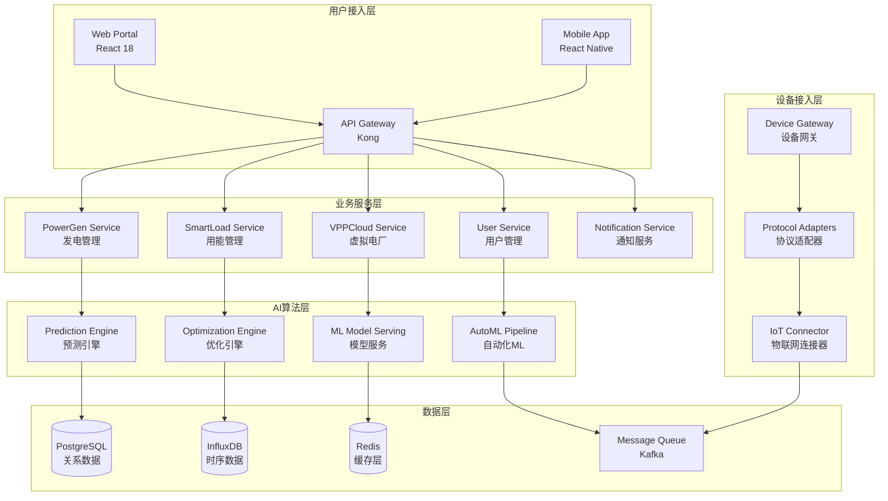

# DeepEngine分布式能源平台技术架构设计文档

[](#)
[](#)
[](#)

> 📐 **文档目标**: 定义DeepEngine平台的完整技术架构  
> 🏗️ **设计理念**: AI原生 + 云原生 + 微服务 + 事件驱动  
> ⚡ **性能目标**: 支持10万+设备，99.95%可用性，<2秒响应时间

---

## 📋 架构概览

### 🎯 架构设计原则

#### 1. AI原生架构设计
```typescript
interface AINativeArchitecture {
  // AI优先的设计理念
  aiFirst: {
    developmentStrategy: "90% AI代码生成 + 10% 人工优化";
    algorithmEngine: "多模型融合预测引擎";
    decisionMaking: "AI驱动的智能决策系统";
    optimization: "自适应算法优化";
  };
  
  // 智能化服务层
  intelligentServices: {
    predictionService: "AI功率预测服务";
    optimizationService: "AI负荷优化服务";
    anomalyDetection: "AI异常检测服务";
    recommendationEngine: "AI推荐引擎";
  };
  
  // AI模型管理
  modelManagement: {
    modelRegistry: "模型注册和版本管理";
    modelServing: "模型推理服务";
    modelMonitoring: "模型性能监控";
    autoMLOps: "自动化ML运维";
  };
}
```

#### 2. 云原生架构特性
```yaml
# 云原生技术栈配置
cloudNativeStack:
  containerization:
    runtime: "Docker 24.x"
    orchestration: "Kubernetes 1.28+"
    serviceRegistry: "Consul/Etcd"
    
  microservices:
    apiGateway: "Kong/Traefik"
    serviceMesh: "Istio 1.19+"
    loadBalancer: "Envoy Proxy"
    circuitBreaker: "Hystrix/Resilience4j"
    
  observability:
    metrics: "Prometheus + Grafana"
    logging: "ELK/EFK Stack"
    tracing: "Jaeger/Zipkin"
    alerting: "AlertManager + PagerDuty"
    
  storage:
    objectStorage: "MinIO/AWS S3"
    persistence: "Longhorn/Ceph"
    backup: "Velero"
```

### 🏗️ 总体架构图



---

## 🔧 详细架构设计

### 📱 前端架构设计

#### React应用架构
```typescript
// 前端架构设计
interface FrontendArchitecture {
  // 技术栈配置
  techStack: {
    framework: "React 18.2 + TypeScript 5.0";
    styling: "Tailwind CSS 3.x + Styled Components";
    stateManagement: "Zustand + React Query";
    routing: "React Router v6";
    testing: "Jest + Testing Library + Playwright";
  };
  
  // 模块化设计
  moduleStructure: {
    powerGen: {
      components: ["Dashboard", "ForecastChart", "DeviceMonitor"];
      hooks: ["usePowerGenData", "useStorageOptimization"];
      services: ["powerGenAPI", "forecastService"];
    };
    
    smartLoad: {
      components: ["LoadDashboard", "OptimizationPanel", "DRManager"];
      hooks: ["useLoadOptimization", "useDemandResponse"];
      services: ["loadAPI", "optimizationService"];
    };
    
    vppCloud: {
      components: ["VPPCenter", "ResourceMap", "TradingPanel"];
      hooks: ["useVPPData", "useMarketTrading"];
      services: ["vppAPI", "tradingService"];
    };
  };
  
  // 组件设计系统
  designSystem: {
    colorPalette: "能源主题配色方案";
    typography: "Inter字体系统";
    iconLibrary: "React Icons + 自定义能源图标";
    animations: "Framer Motion + CSS动画";
  };
}

// 组件架构示例
const PowerGenDashboard: React.FC = () => {
  // 状态管理
  const { data, loading, error } = usePowerGenData();
  const { optimizationResult } = useStorageOptimization(data);
  
  // 实时数据订阅
  const { realTimeData } = useWebSocket('/ws/powergen');
  
  return (
    <div className="power-gen-layout">
      <MetricsOverview data={data} />
      <ForecastChart forecast={data.forecast} />
      <DeviceStatusGrid devices={data.devices} />
      <OptimizationPanel result={optimizationResult} />
    </div>
  );
};
```

#### 移动端架构
```typescript
// React Native移动端架构
interface MobileArchitecture {
  navigation: {
    structure: "Stack + Bottom Tab Navigation";
    authenticatedFlow: "PowerGen -> SmartLoad -> VPPCloud";
    guestFlow: "Login -> Register -> Demo";
  };
  
  dataSync: {
    strategy: "Redux Persist + Background Sync";
    caching: "React Query with offline support";
    push: "Firebase Cloud Messaging";
  };
  
  performance: {
    bundleSize: "<10MB optimized";
    launchTime: "<3s cold start";
    memoryUsage: "<100MB average";
    batteryOptimization: "Background task optimization";
  };
}
```

### ⚙️ 后端架构设计

#### 微服务架构
```python
# 微服务架构设计
class MicroservicesArchitecture:
    """
    基于领域驱动设计的微服务架构
    """
    
    def __init__(self):
        self.services = {
            # 核心业务服务
            'powergen_service': PowerGenService(),
            'smartload_service': SmartLoadService(),
            'vppcloud_service': VPPCloudService(),
            
            # 基础设施服务
            'user_service': UserManagementService(),
            'notification_service': NotificationService(),
            'file_service': FileManagementService(),
            'audit_service': AuditLoggingService(),
            
            # AI算法服务
            'prediction_service': PredictionService(),
            'optimization_service': OptimizationService(),
            'ml_model_service': MLModelService(),
            
            # 设备集成服务
            'device_gateway': DeviceGatewayService(),
            'protocol_adapter': ProtocolAdapterService(),
            'data_collector': DataCollectionService()
        }
    
    async def setup_service_communication(self):
        """设置服务间通信"""
        # 同步通信 - gRPC
        grpc_services = [
            'user_service', 'powergen_service', 
            'smartload_service', 'vppcloud_service'
        ]
        
        # 异步通信 - Message Queue
        async_services = [
            'notification_service', 'audit_service',
            'data_collector', 'ml_model_service'
        ]
        
        # 事件驱动架构
        event_patterns = {
            'PowerGenerationUpdated': ['prediction_service', 'optimization_service'],
            'DeviceAnomalyDetected': ['notification_service', 'audit_service'],
            'MarketPriceChanged': ['vppcloud_service', 'optimization_service']
        }

# 服务实现示例 - PowerGen Service
class PowerGenService:
    """发电管理服务"""
    
    def __init__(self):
        self.prediction_engine = PredictionEngine()
        self.device_manager = DeviceManager()
        self.storage_optimizer = StorageOptimizer()
    
    async def get_power_forecast(self, device_id: str, timeframe: str) -> ForecastResult:
        """获取功率预测"""
        # 获取设备数据
        device_data = await self.device_manager.get_device_data(device_id)
        
        # AI预测
        forecast = await self.prediction_engine.predict(device_data, timeframe)
        
        # 发布事件
        await self.publish_event('PowerForecastGenerated', {
            'device_id': device_id,
            'forecast': forecast,
            'timestamp': datetime.now()
        })
        
        return forecast
    
    async def optimize_storage(self, storage_config: StorageConfig) -> OptimizationResult:
        """储能优化"""
        return await self.storage_optimizer.optimize(storage_config)
```

#### API网关设计
```yaml
# Kong API网关配置
apiGateway:
  kong:
    version: "3.4.x"
    plugins:
      - authentication: "JWT + OAuth2"
      - rateLimit: "1000 req/min per user"
      - cors: "Cross-origin resource sharing"
      - logging: "Request/response logging"
      - monitoring: "Prometheus metrics"
    
    routes:
      - path: "/api/v1/powergen/*"
        service: "powergen-service"
        methods: ["GET", "POST", "PUT", "DELETE"]
        
      - path: "/api/v1/smartload/*"
        service: "smartload-service" 
        methods: ["GET", "POST", "PUT", "DELETE"]
        
      - path: "/api/v1/vppcloud/*"
        service: "vppcloud-service"
        methods: ["GET", "POST", "PUT", "DELETE"]
    
    security:
      - jwt_validation: true
      - ip_whitelist: "optional"
      - ssl_termination: true
      - rate_limiting: "per_user + global"
```

### 🧠 AI算法架构

#### 多模型融合预测引擎
```python
# AI算法架构设计
class AIAlgorithmArchitecture:
    """
    AI算法架构 - 多模型融合预测系统
    """
    
    def __init__(self):
        # 模型注册表
        self.model_registry = {
            'lstm_power_forecast': LSTMPowerForecastModel(),
            'transformer_load_predict': TransformerLoadModel(),
            'lightgbm_price_forecast': LightGBMPriceModel(),
            'prophet_seasonal': ProphetSeasonalModel(),
            'reinforcement_optimizer': RLOptimizationModel()
        }
        
        # 模型服务框架
        self.model_serving = {
            'serving_framework': 'TensorFlow Serving + MLflow',
            'inference_engine': 'ONNX Runtime',
            'gpu_acceleration': 'CUDA + TensorRT',
            'batch_processing': 'Apache Beam'
        }
        
        # 自动化ML流水线
        self.automl_pipeline = {
            'data_preparation': 'Apache Airflow',
            'feature_engineering': 'Feast Feature Store',
            'model_training': 'Kubeflow Pipelines',
            'model_validation': 'MLflow Model Registry',
            'deployment': 'Seldon Core'
        }
    
    async def ensemble_prediction(self, input_data: InputData) -> PredictionResult:
        """集成预测"""
        # 并行执行多个模型
        predictions = await asyncio.gather(*[
            model.predict(input_data) 
            for model in self.model_registry.values()
        ])
        
        # 动态权重分配
        weights = await self.calculate_dynamic_weights(predictions)
        
        # 集成结果
        ensemble_result = self.weighted_ensemble(predictions, weights)
        
        return ensemble_result

# 深度强化学习架构
class ReinforcementLearningEngine:
    """强化学习引擎 - 用于负荷优化"""
    
    def __init__(self):
        self.agent_config = {
            'algorithm': 'PPO (Proximal Policy Optimization)',
            'network_architecture': 'Actor-Critic Network',
            'state_space': 'Continuous (load, price, weather, comfort)',
            'action_space': 'Continuous (device control)',
            'reward_function': 'Multi-objective (cost + comfort + environment)'
        }
        
        self.training_config = {
            'framework': 'Stable-Baselines3 + PyTorch',
            'parallel_envs': 16,
            'training_steps': 1000000,
            'evaluation_frequency': 10000,
            'model_checkpointing': 'every 50k steps'
        }
    
    async def optimize_load_schedule(self, environment_state: EnvironmentState) -> OptimizationAction:
        """负荷调度优化"""
        # 状态预处理
        processed_state = self.preprocess_state(environment_state)
        
        # 策略网络推理
        action_probabilities = await self.policy_network.forward(processed_state)
        
        # 动作采样
        action = self.sample_action(action_probabilities)
        
        # 动作后处理
        optimization_action = self.postprocess_action(action)
        
        return optimization_action
```

### 💾 数据架构设计

#### 数据湖架构
```python
# 数据架构设计
class DataArchitecture:
    """
    Lambda架构 + 数据湖设计
    """
    
    def __init__(self):
        # 数据分层架构
        self.data_layers = {
            'bronze': 'Raw data ingestion layer',
            'silver': 'Cleaned and validated data',
            'gold': 'Business-ready aggregated data'
        }
        
        # 存储系统
        self.storage_systems = {
            'operational': 'PostgreSQL 15+ (OLTP)',
            'analytical': 'ClickHouse (OLAP)',
            'time_series': 'InfluxDB 2.x',
            'document': 'MongoDB (metadata)',
            'cache': 'Redis Cluster',
            'object': 'MinIO (S3 compatible)'
        }
        
        # 数据处理引擎
        self.processing_engines = {
            'stream': 'Apache Kafka + Kafka Streams',
            'batch': 'Apache Spark + Delta Lake',
            'real_time': 'Apache Flink',
            'ml': 'Apache Spark MLlib + MLflow'
        }
    
    async def setup_data_pipeline(self):
        """设置数据流水线"""
        # 实时数据流
        streaming_pipeline = {
            'source': 'IoT devices + Market APIs',
            'ingestion': 'Kafka Connect',
            'processing': 'Kafka Streams + Flink',
            'sink': 'InfluxDB + Redis'
        }
        
        # 批处理流水线
        batch_pipeline = {
            'source': 'Data Lake (Bronze)',
            'processing': 'Spark ETL jobs',
            'transformation': 'Data quality + Feature engineering',
            'sink': 'Data Warehouse (Gold)'
        }
        
        return {
            'streaming': streaming_pipeline,
            'batch': batch_pipeline
        }

# 数据模型设计
class DataModels:
    """核心数据模型"""
    
    def __init__(self):
        self.schemas = {
            'power_generation': {
                'device_id': 'UUID',
                'timestamp': 'TIMESTAMPTZ',
                'active_power': 'FLOAT',
                'reactive_power': 'FLOAT',
                'voltage': 'FLOAT',
                'current': 'FLOAT',
                'temperature': 'FLOAT',
                'irradiance': 'FLOAT',
                'wind_speed': 'FLOAT'
            },
            
            'energy_consumption': {
                'meter_id': 'UUID',
                'timestamp': 'TIMESTAMPTZ',
                'total_consumption': 'FLOAT',
                'peak_demand': 'FLOAT',
                'load_profile': 'JSONB',
                'tariff_type': 'VARCHAR',
                'cost': 'DECIMAL'
            },
            
            'market_data': {
                'market_id': 'VARCHAR',
                'timestamp': 'TIMESTAMPTZ',
                'price_type': 'ENUM',
                'price_value': 'DECIMAL',
                'volume': 'FLOAT',
                'region': 'VARCHAR'
            }
        }
```

### 🔐 安全架构设计

#### 零信任安全架构
```yaml
# 安全架构配置
securityArchitecture:
  zeroTrust:
    principle: "Never trust, always verify"
    implementation:
      - identity_verification: "Multi-factor authentication"
      - device_verification: "Device certificates + attestation"
      - network_segmentation: "Micro-segmentation with Calico"
      - least_privilege: "RBAC + ABAC policy enforcement"
  
  encryption:
    data_at_rest: "AES-256-GCM encryption"
    data_in_transit: "TLS 1.3 + mTLS"
    key_management: "HashiCorp Vault + HSM"
    database: "Transparent Data Encryption (TDE)"
  
  authentication:
    methods: ["OAuth 2.1", "SAML 2.0", "OpenID Connect"]
    mfa: "TOTP + WebAuthn + SMS backup"
    session_management: "JWT with refresh tokens"
    sso: "Enterprise SSO integration"
  
  authorization:
    model: "RBAC + ABAC hybrid"
    policies: "Open Policy Agent (OPA)"
    fine_grained: "Resource-level permissions"
    audit: "Complete access audit trail"
  
  compliance:
    standards: ["ISO 27001", "SOC 2 Type II", "GDPR"]
    monitoring: "SIEM + SOAR integration"
    incident_response: "Automated security playbooks"
    vulnerability_management: "Continuous security scanning"
```

### 📊 监控与可观测性

#### 全栈监控架构
```python
# 监控架构设计
class ObservabilityArchitecture:
    """
    全栈可观测性架构
    """
    
    def __init__(self):
        # 三大支柱
        self.three_pillars = {
            'metrics': {
                'collection': 'Prometheus + Grafana',
                'alerting': 'AlertManager + PagerDuty',
                'custom_metrics': 'Business KPIs + SLIs'
            },
            
            'logging': {
                'aggregation': 'ELK/EFK Stack',
                'structured_logging': 'JSON format + correlation IDs',
                'log_levels': 'DEBUG/INFO/WARN/ERROR/FATAL'
            },
            
            'tracing': {
                'distributed_tracing': 'Jaeger + OpenTelemetry',
                'performance_profiling': 'Pyroscope + pprof',
                'user_journey_tracking': 'Custom instrumentation'
            }
        }
        
        # SLI/SLO定义
        self.sli_slo = {
            'availability': {
                'sli': 'Successful requests / Total requests',
                'slo': '99.95% availability',
                'error_budget': '0.05% (4.32 hours/month)'
            },
            
            'latency': {
                'sli': 'Request response time',
                'slo': 'P99 < 2 seconds',
                'measurement': 'API Gateway metrics'
            },
            
            'throughput': {
                'sli': 'Requests per second',
                'slo': '10,000 RPS peak capacity',
                'scaling': 'Auto-scaling triggers'
            }
        }
    
    def setup_alerts(self):
        """设置告警规则"""
        alert_rules = {
            'critical': {
                'service_down': 'Send immediate page',
                'data_loss': 'Escalate to on-call engineer',
                'security_breach': 'Trigger incident response'
            },
            
            'warning': {
                'high_latency': 'Slack notification',
                'resource_usage': 'Email to ops team',
                'prediction_accuracy': 'ML team notification'
            },
            
            'info': {
                'deployment_success': 'Deployment channel',
                'scheduled_maintenance': 'General notifications',
                'capacity_planning': 'Weekly reports'
            }
        }
        
        return alert_rules
```

---

## 🚀 部署架构

### ☁️ 云原生部署

#### Kubernetes集群设计
```yaml
# Kubernetes部署架构
apiVersion: v1
kind: ConfigMap
metadata:
  name: deepengine-cluster-config
data:
  cluster-config.yaml: |
    cluster:
      name: "deepengine-production"
      version: "1.28.x"
      nodes:
        master:
          count: 3
          instance_type: "c5.xlarge"
          zones: ["us-west-2a", "us-west-2b", "us-west-2c"]
        
        worker:
          count: 10
          instance_type: "c5.2xlarge"  
          auto_scaling:
            min: 5
            max: 20
            target_cpu: 70%
        
        gpu_worker:
          count: 2
          instance_type: "p3.2xlarge"
          purpose: "ML model training/inference"
      
      networking:
        cni: "Calico"
        service_mesh: "Istio"
        ingress: "NGINX Ingress Controller"
        dns: "CoreDNS"
      
      storage:
        csi_driver: "AWS EBS CSI"
        storage_classes:
          - name: "fast-ssd"
            type: "gp3"
            iops: 3000
          - name: "standard"
            type: "gp2"
      
      addons:
        - "cluster-autoscaler"
        - "aws-load-balancer-controller"
        - "metrics-server"
        - "kube-state-metrics"
```

#### 多环境部署策略
```yaml
# 环境配置
environments:
  development:
    cluster: "deepengine-dev"
    replicas: 1
    resources:
      cpu: "100m"
      memory: "256Mi"
    database: "PostgreSQL (single instance)"
    
  staging:
    cluster: "deepengine-staging"
    replicas: 2
    resources:
      cpu: "500m" 
      memory: "1Gi"
    database: "PostgreSQL (replica)"
    
  production:
    cluster: "deepengine-prod"
    replicas: 3
    resources:
      cpu: "2"
      memory: "4Gi"
    database: "PostgreSQL (HA cluster)"
    
  disaster_recovery:
    cluster: "deepengine-dr"
    region: "us-east-1"
    sync_strategy: "Cross-region replication"
```

### 📈 扩展性设计

#### 水平扩展策略
```python
# 扩展性架构设计
class ScalabilityArchitecture:
    """
    可扩展性架构设计
    """
    
    def __init__(self):
        # 扩展维度
        self.scaling_dimensions = {
            'horizontal': {
                'pods': 'Kubernetes HPA + VPA',
                'nodes': 'Cluster Autoscaler',
                'regions': 'Multi-region deployment',
                'databases': 'Read replicas + Sharding'
            },
            
            'vertical': {
                'cpu': 'CPU-based scaling',
                'memory': 'Memory-based scaling', 
                'storage': 'Dynamic volume expansion',
                'network': 'Bandwidth optimization'
            }
        }
        
        # 性能目标
        self.performance_targets = {
            'concurrent_users': 10000,
            'devices_supported': 100000,
            'api_requests_per_second': 10000,
            'data_processing_rate': '1M points/second',
            'prediction_latency': '<500ms',
            'optimization_time': '<30s'
        }
    
    def design_sharding_strategy(self):
        """数据分片策略"""
        sharding_config = {
            'time_series_data': {
                'strategy': 'Time-based partitioning',
                'partition_interval': '1 month',
                'retention_policy': '5 years'
            },
            
            'device_data': {
                'strategy': 'Device ID hash-based',
                'shard_count': 16,
                'replication_factor': 3
            },
            
            'user_data': {
                'strategy': 'Geographic-based',
                'regions': ['north', 'south', 'east', 'west'],
                'failover': 'Cross-region backup'
            }
        }
        
        return sharding_config
```

---

## 📝 技术选型说明

### 🛠️ 技术栈对比分析

| 技术领域 | 选择方案 | 备选方案 | 选择理由 |
|---------|----------|----------|----------|
| **前端框架** | React 18 | Vue 3, Angular 15 | 生态完善，AI辅助开发友好 |
| **后端语言** | Python + Java + Node.js | Go, Rust, C# | 保留现有投资，AI算法支持 |
| **数据库** | PostgreSQL | MySQL, MongoDB | ACID特性，JSON支持，扩展性 |
| **时序数据库** | InfluxDB | TimescaleDB, ClickHouse | 专业时序，压缩比高 |
| **消息队列** | Apache Kafka | RabbitMQ, NATS | 高吞吐量，流处理支持 |
| **容器编排** | Kubernetes | Docker Swarm, Nomad | 云原生标准，生态丰富 |
| **监控方案** | Prometheus + Grafana | DataDog, New Relic | 开源，可定制，成本控制 |
| **AI框架** | PyTorch + TensorFlow | JAX, MXNet | 模型丰富，部署成熟 |

### 🎯 架构决策记录(ADR)

#### ADR-001: 微服务vs单体架构
**决策**: 采用微服务架构  
**理由**: 
- 支持团队独立开发和部署
- 便于水平扩展和技术选型
- 符合云原生最佳实践
- 支持容错和服务隔离

#### ADR-002: 同步vs异步通信
**决策**: 混合模式 - 核心业务同步，辅助功能异步  
**理由**:
- 用户界面操作需要即时响应
- 数据处理和通知可以异步
- 平衡性能和一致性需求

#### ADR-003: AI模型部署策略
**决策**: 模型即服务(Model as a Service)  
**理由**:
- 支持模型独立更新和版本管理
- 便于A/B测试和渐进式发布
- 资源隔离和性能优化

---

## 📋 实施路线图

### 🚀 Phase 1: 基础设施搭建 (Week 1-4)
- [ ] Kubernetes集群部署
- [ ] CI/CD流水线建设
- [ ] 监控和日志系统
- [ ] 安全基础设施

### 🏗️ Phase 2: 核心服务开发 (Week 5-12)
- [ ] 用户管理服务
- [ ] PowerGen服务
- [ ] SmartLoad服务
- [ ] 基础AI服务

### 🧠 Phase 3: AI算法集成 (Week 13-20)
- [ ] 预测模型部署
- [ ] 优化算法服务
- [ ] 模型管理平台
- [ ] 性能调优

### 🌐 Phase 4: 前端集成 (Week 21-24)
- [ ] React应用开发
- [ ] 移动端应用
- [ ] 用户体验优化
- [ ] 集成测试

---

**文档版本**: v1.0  
**创建日期**: 2024-12-29  
**技术架构师**: DeepEngine架构组  
**审核状态**: 待Review

> 🏗️ **架构演进**: 本架构设计将根据业务发展和技术演进持续优化，保持技术前瞻性和业务适应性。 