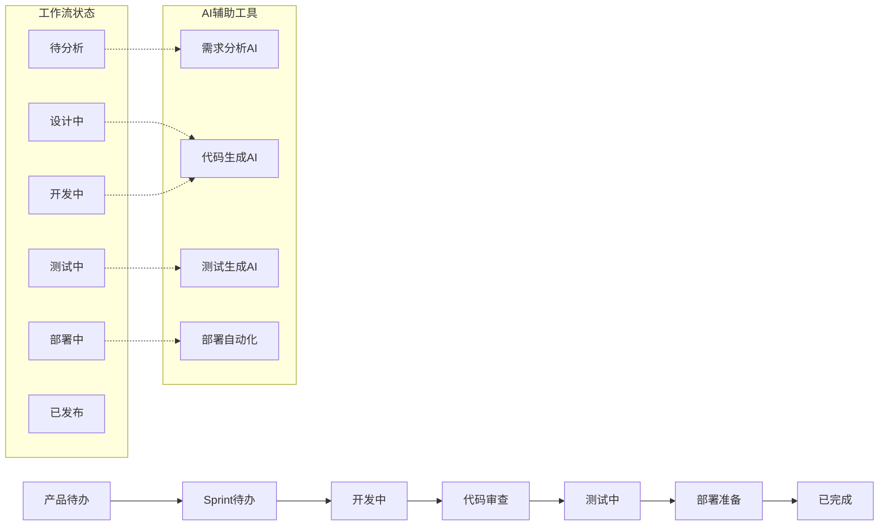

# DeepEngine项目管理和协作规范

[](#)
[](#)
[](#)

> 📋 **文档目标**: 建立高效的AI驱动敏捷开发管理体系  
> 🤝 **协作理念**: 透明沟通 + 自动化流程 + 持续改进  
> 🎯 **管理目标**: 交付质量95%+，进度达成率90%+，团队满意度9+

---

## 📊 项目管理框架

### 🎯 敏捷开发方法论

#### 1. Scrum框架适配
```typescript
// DeepEngine敏捷开发配置
interface DeepEngineAgileFramework {
  scrumAdaptation: {
    sprintDuration: "2周"; // 短周期快速迭代
    teamSize: "5-7人"; // 跨职能团队
    ceremonies: {
      dailyStandup: "每日9:00, 15分钟";
      sprintPlanning: "Sprint开始日, 2小时";
      sprintReview: "Sprint结束日, 1小时";
      retrospective: "Sprint结束日, 1小时";
    };
    artifacts: {
      productBacklog: "产品待办列表";
      sprintBacklog: "Sprint待办列表";
      increment: "可交付产品增量";
    };
  };
  
  roles: {
    productOwner: {
      responsibilities: [
        "产品愿景和路线图制定",
        "用户故事编写和优先级排序",
        "验收标准定义",
        "利益相关者沟通"
      ];
      aiTools: ["Claude for requirement analysis", "ChatGPT for user stories"];
    };
    
    scrumMaster: {
      responsibilities: [
        "敏捷流程推进和优化",
        "团队协作促进",
        "障碍清除",
        "持续改进引导"
      ];
      aiTools: ["AI project tracking", "Automated reporting"];
    };
    
    developmentTeam: {
      roles: ["前端开发", "后端开发", "AI算法工程师", "测试工程师", "DevOps工程师"];
      crossFunctional: true;
      selfOrganizing: true;
      aiCollaboration: "90%+ AI辅助开发";
    };
  };
}
```

#### 2. 看板管理系统


### 📈 项目进度管理

#### 里程碑和交付计划
```typescript
// 项目里程碑定义
interface ProjectMilestones {
  phase1_mvp: {
    duration: "3个月";
    startDate: "2024-01-01";
    endDate: "2024-03-31";
    deliverables: [
      "PowerGen基础功能模块",
      "SmartLoad负荷监控",
      "基础AI预测算法",
      "Web管理平台MVP"
    ];
    successCriteria: {
      functionalCompletion: "100%";
      performanceTargets: "API响应<2s, 可用性>99%";
      userAcceptance: "核心用户满意度>8分";
    };
  };
  
  phase2_professional: {
    duration: "3个月";
    startDate: "2024-04-01";
    endDate: "2024-06-30";
    deliverables: [
      "VPPCloud虚拟电厂模块",
      "移动端应用",
      "高级AI算法集成",
      "企业级安全和监控"
    ];
    successCriteria: {
      functionalCompletion: "100%";
      scalabilityTargets: "支持1万+设备";
      marketReadiness: "商业化准备就绪";
    };
  };
  
  phase3_enterprise: {
    duration: "6个月";
    startDate: "2024-07-01";
    endDate: "2024-12-31";
    deliverables: [
      "边缘计算支持",
      "区块链集成",
      "生态合作伙伴平台",
      "国际化支持"
    ];
    successCriteria: {
      enterpriseFeatures: "100% enterprise ready";
      globalScale: "支持多区域部署";
      ecosystemIntegration: "10+合作伙伴集成";
    };
  };
}
```

#### 进度跟踪和报告
```python
# AI驱动的项目进度跟踪
class AIProjectTracker:
    def __init__(self):
        self.tracking_metrics = {
            'velocity': 'Sprint速度趋势',
            'burndown': 'Sprint燃尽图',
            'quality': '代码质量指标',
            'risks': '风险识别和缓解',
            'dependencies': '依赖关系管理'
        }
    
    def generate_sprint_report(self, sprint_id: str) -> SprintReport:
        """生成Sprint报告"""
        return SprintReport(
            sprint_id=sprint_id,
            planned_story_points=40,
            completed_story_points=38,
            velocity=38,  # 完成的故事点
            burndown_trend='健康',
            quality_metrics={
                'code_coverage': '92%',
                'bug_rate': '0.8 bugs/1000 lines',
                'ai_code_percentage': '91%'
            },
            blockers=[
                '第三方API集成延迟',
                '测试环境配置问题'
            ],
            achievements=[
                '功率预测算法MAPE降至2.1%',
                '移动端界面完成90%',
                'API性能优化完成'
            ],
            next_sprint_plan=[
                '完成VPP资源聚合功能',
                '集成测试和性能调优',
                '用户验收测试准备'
            ]
        )
    
    def predict_project_risks(self, project_data: ProjectData) -> RiskAssessment:
        """AI预测项目风险"""
        risk_factors = {
            'schedule_delay': self.analyze_schedule_risk(project_data),
            'technical_complexity': self.analyze_technical_risk(project_data),
            'resource_availability': self.analyze_resource_risk(project_data),
            'external_dependencies': self.analyze_dependency_risk(project_data)
        }
        
        return RiskAssessment(
            overall_risk_level='中等',
            critical_risks=[
                '第三方天气数据API稳定性',
                'AI模型训练数据质量'
            ],
            mitigation_strategies=[
                '建立备用数据源',
                '加强数据质量监控',
                '增加测试覆盖率'
            ]
        )
```

---

## 🤝 团队协作规范

### 👥 团队组织架构

#### 跨职能团队配置
```typescript
// 团队结构定义
interface TeamStructure {
  productTeam: {
    productManager: {
      name: "产品经理";
      responsibilities: ["产品规划", "需求管理", "用户体验设计"];
      skills: ["业务分析", "用户研究", "产品设计"];
      aiTools: ["需求分析AI", "用户研究AI"];
    };
    
    uxDesigner: {
      name: "用户体验设计师";
      responsibilities: ["界面设计", "交互设计", "用户测试"];
      skills: ["UI/UX设计", "原型制作", "用户研究"];
      aiTools: ["设计生成AI", "用户反馈分析AI"];
    };
  };
  
  developmentTeam: {
    techLead: {
      name: "技术负责人";
      responsibilities: ["技术架构", "代码审查", "技术决策"];
      skills: ["系统架构", "代码质量", "技术选型"];
      experience: "8+年";
    };
    
    frontendDevs: {
      count: 2;
      skills: ["React", "TypeScript", "Tailwind CSS"];
      aiProficiency: "高级";
      responsibilities: ["前端开发", "用户界面实现", "性能优化"];
    };
    
    backendDevs: {
      count: 2;
      skills: ["Python", "FastAPI", "PostgreSQL", "Docker"];
      aiProficiency: "高级";
      responsibilities: ["后端开发", "API设计", "数据库设计"];
    };
    
    aiEngineers: {
      count: 2;
      skills: ["PyTorch", "机器学习", "时间序列分析", "强化学习"];
      aiProficiency: "专家级";
      responsibilities: ["算法开发", "模型训练", "AI服务部署"];
    };
    
    qaEngineers: {
      count: 1;
      skills: ["自动化测试", "性能测试", "安全测试"];
      aiProficiency: "中级";
      responsibilities: ["测试计划", "质量保证", "缺陷管理"];
    };
    
    devopsEngineer: {
      count: 1;
      skills: ["Kubernetes", "CI/CD", "监控", "安全"];
      aiProficiency: "中级";
      responsibilities: ["基础设施", "部署自动化", "系统监控"];
    };
  };
}
```

### 📅 会议和沟通机制

#### 敏捷仪式优化
```yaml
# 敏捷会议配置
agileCeremonies:
  dailyStandup:
    time: "09:00-09:15"
    format: "线下+线上混合"
    participants: "开发团队全员"
    structure:
      - 昨日完成工作
      - 今日计划工作
      - 遇到的障碍
      - AI工具使用情况
    tools: ["Slack standup bot", "Jira integration"]
    
  sprintPlanning:
    duration: "2小时"
    phases:
      phase1: "产品待办列表梳理 (30分钟)"
      phase2: "Sprint目标制定 (30分钟)"
      phase3: "任务分解和估点 (60分钟)"
    aiAssistance:
      - "需求理解和澄清"
      - "工作量自动估算"
      - "依赖关系分析"
      
  sprintReview:
    duration: "1小时"
    agenda:
      - "功能演示 (30分钟)"
      - "利益相关者反馈 (20分钟)"
      - "下一步计划 (10分钟)"
    participants:
      - "开发团队"
      - "产品负责人"
      - "利益相关者"
      
  retrospective:
    duration: "1小时"
    format: "Start-Stop-Continue"
    focus:
      - "AI工具使用效果"
      - "开发流程优化"
      - "团队协作改进"
    output: "行动计划和改进措施"
```

#### 沟通渠道管理
```typescript
// 团队沟通架构
interface CommunicationChannels {
  synchronous: {
    dailyStandup: "每日同步会议";
    adhocMeetings: "临时讨论会议";
    pairProgramming: "结对编程会话";
    codeReview: "代码审查讨论";
  };
  
  asynchronous: {
    slack: {
      channels: {
        general: "团队日常交流";
        development: "技术讨论";
        ai_tools: "AI工具使用交流";
        alerts: "系统告警通知";
        random: "非正式交流";
      };
      integrations: ["Jira", "GitHub", "CI/CD", "Monitoring"];
    };
    
    documentation: {
      wiki: "项目知识库";
      api_docs: "API文档";
      runbooks: "运维手册";
      architecture: "架构文档";
    };
  };
  
  tools: {
    videoConferencing: "Zoom/Teams";
    instantMessaging: "Slack";
    codeCollaboration: "GitHub + Cursor";
    projectManagement: "Jira + Confluence";
    designCollaboration: "Figma";
  };
}
```

---

## 📋 工作流程和规范

### 🔄 开发工作流

#### Git工作流规范
```yaml
# Git工作流配置
gitWorkflow:
  branchingStrategy: "GitFlow"
  branches:
    main:
      purpose: "生产环境代码"
      protection: "需要PR审查+CI通过"
      deployTo: "生产环境"
      
    develop:
      purpose: "开发集成分支"
      protection: "需要PR审查"
      deployTo: "测试环境"
      
    feature:
      naming: "feature/JIRA-123-feature-description"
      purpose: "功能开发分支"
      lifecycle: "开发完成后合并到develop"
      
    release:
      naming: "release/v1.2.0"
      purpose: "发布准备分支"
      activities: ["bug修复", "版本号更新", "发布文档"]
      
    hotfix:
      naming: "hotfix/v1.2.1-critical-bug"
      purpose: "紧急修复分支"
      process: "直接从main分出，修复后合并回main和develop"

  commitConventions:
    format: "type(scope): description"
    types:
      - "feat: 新功能"
      - "fix: 缺陷修复"
      - "docs: 文档更新"
      - "style: 代码格式"
      - "refactor: 重构"
      - "perf: 性能优化"
      - "test: 测试相关"
      - "chore: 构建和工具"
      - "ai: AI辅助生成的代码"
    
    examples:
      - "feat(powergen): add solar power forecasting API"
      - "fix(auth): resolve JWT token expiration issue"
      - "ai(frontend): generate PowerGen dashboard components"
```

#### 代码审查流程
```typescript
// 代码审查工作流
interface CodeReviewProcess {
  prRequirements: {
    description: "清晰的PR描述，包含改动内容和测试情况";
    tests: "新增代码必须包含相应测试";
    documentation: "API变更必须更新文档";
    aiGenerated: "标注AI生成的代码比例";
    screenshots: "UI变更需要提供截图";
  };
  
  reviewCriteria: {
    functionality: "功能是否符合需求";
    codeQuality: "代码质量和可维护性";
    performance: "性能影响评估";
    security: "安全性检查";
    testCoverage: "测试覆盖率要求";
    documentation: "文档完整性";
  };
  
  reviewAssignment: {
    automatic: "自动分配给相关模块负责人";
    requiredReviewers: 2; // 至少2人审查
    expertise: "涉及AI算法需要AI工程师审查";
    architecture: "架构变更需要技术负责人审查";
  };
  
  aiAssistedReview: {
    codeAnalysis: "AI自动代码质量分析";
    securityScan: "安全漏洞自动检测";
    performanceCheck: "性能影响预估";
    testSuggestions: "测试用例建议";
  };
}
```

### 📊 质量保障流程

#### 质量门禁设置
```python
# 质量门禁配置
class QualityGates:
    def __init__(self):
        self.gates = {
            'code_commit': self.commit_quality_gate,
            'pull_request': self.pr_quality_gate,
            'integration': self.integration_quality_gate,
            'pre_deployment': self.deployment_quality_gate
        }
    
    def commit_quality_gate(self, code_changes):
        """提交质量门禁"""
        checks = [
            self.lint_check(code_changes),
            self.type_check(code_changes),
            self.security_scan(code_changes),
            self.unit_tests(code_changes)
        ]
        return all(checks)
    
    def pr_quality_gate(self, pull_request):
        """PR质量门禁"""
        requirements = {
            'code_review': pull_request.approved_reviewers >= 2,
            'ci_tests': pull_request.ci_status == 'passed',
            'coverage': pull_request.test_coverage >= 0.90,
            'documentation': pull_request.has_documentation_updates,
            'ai_review': pull_request.ai_analysis_score >= 8.0
        }
        return all(requirements.values())
    
    def integration_quality_gate(self, build):
        """集成质量门禁"""
        criteria = {
            'integration_tests': build.integration_test_pass_rate >= 0.95,
            'performance_tests': build.performance_degradation < 0.05,
            'security_tests': build.security_vulnerabilities == 0,
            'api_tests': build.api_test_success_rate >= 0.98
        }
        return all(criteria.values())
    
    def deployment_quality_gate(self, deployment):
        """部署质量门禁"""
        checks = {
            'smoke_tests': deployment.smoke_tests_passed,
            'health_checks': deployment.health_score >= 0.95,
            'rollback_plan': deployment.has_rollback_plan,
            'monitoring': deployment.monitoring_configured
        }
        return all(checks.values())
```

---

## 📈 项目监控和报告

### 📊 关键绩效指标(KPI)

#### 开发效率指标
```typescript
// 项目KPI仪表盘
interface ProjectKPIDashboard {
  developmentEfficiency: {
    velocity: {
      current: 38;
      target: 35;
      trend: "上升";
      unit: "故事点/Sprint";
    };
    
    aiCodeGeneration: {
      current: 0.91;
      target: 0.90;
      trend: "稳定";
      unit: "百分比";
    };
    
    cycleTime: {
      current: 3.2;
      target: 4.0;
      trend: "下降";
      unit: "天";
    };
    
    leadTime: {
      current: 8.5;
      target: 10.0;
      trend: "下降";
      unit: "天";
    };
  };
  
  qualityMetrics: {
    defectRate: {
      current: 0.008;
      target: 0.010;
      trend: "下降";
      unit: "缺陷/千行代码";
    };
    
    testCoverage: {
      current: 0.92;
      target: 0.90;
      trend: "稳定";
      unit: "百分比";
    };
    
    codeReviewEfficiency: {
      current: 1.8;
      target: 2.0;
      trend: "改善";
      unit: "轮次";
    };
  };
  
  businessMetrics: {
    userSatisfaction: {
      current: 8.7;
      target: 8.0;
      trend: "上升";
      unit: "分数(1-10)";
    };
    
    featureAdoptionRate: {
      current: 0.78;
      target: 0.70;
      trend: "上升";
      unit: "百分比";
    };
    
    systemAvailability: {
      current: 0.9998;
      target: 0.9995;
      trend: "稳定";
      unit: "百分比";
    };
  };
}
```

#### 自动化报告生成
```python
# AI驱动的项目报告生成
class ProjectReportGenerator:
    def __init__(self):
        self.report_types = {
            'daily': self.generate_daily_report,
            'weekly': self.generate_weekly_report,
            'sprint': self.generate_sprint_report,
            'monthly': self.generate_monthly_report
        }
    
    def generate_executive_dashboard(self) -> ExecutiveDashboard:
        """生成高管仪表盘"""
        return ExecutiveDashboard(
            project_health="绿色",
            progress_summary="按计划进行，完成度92%",
            key_achievements=[
                "AI代码生成率达到91%，超过目标",
                "功率预测准确度提升至MAPE 2.1%",
                "移动端应用开发完成90%"
            ],
            critical_issues=[
                "第三方API集成存在延迟风险",
                "测试环境配置需要优化"
            ],
            budget_status="预算使用78%，进度92%",
            next_milestones=[
                "VPP资源聚合功能发布 (2024-02-15)",
                "移动端应用内测版本 (2024-02-28)"
            ],
            risk_assessment="整体风险可控，需关注外部依赖"
        )
    
    def generate_technical_metrics_report(self) -> TechnicalReport:
        """生成技术指标报告"""
        return TechnicalReport(
            performance_metrics={
                'api_response_time': '平均1.2秒，P99 2.8秒',
                'system_throughput': '8500 RPS峰值',
                'availability': '99.98%月度可用性',
                'error_rate': '0.12%系统错误率'
            },
            quality_metrics={
                'code_coverage': '测试覆盖率92%',
                'static_analysis': '代码质量评分A级',
                'security_scan': '无高危漏洞',
                'technical_debt': '技术债务比例5.2%'
            },
            ai_metrics={
                'code_generation': 'AI生成代码91%',
                'review_efficiency': '代码审查时间减少65%',
                'bug_prediction': 'AI缺陷预测准确率87%',
                'optimization_suggestions': '性能优化建议采纳率78%'
            }
        )
```

---

## 🔧 工具和平台集成

### 🛠️ 开发工具链

#### 集成开发环境
```yaml
# 开发工具配置
developmentTools:
  ide:
    primary: "Cursor (AI-powered)"
    secondary: "VS Code"
    plugins:
      - "GitHub Copilot"
      - "ESLint + Prettier"
      - "GitLens"
      - "Thunder Client"
      - "Docker"
      
  versionControl:
    platform: "GitHub Enterprise"
    integrations:
      - "Jira (issue tracking)"
      - "Slack (notifications)"
      - "Cursor (AI code review)"
      
  cicd:
    platform: "GitHub Actions"
    workflows:
      - "lint-and-test"
      - "build-and-deploy"
      - "security-scan"
      - "performance-test"
      
  monitoring:
    application: "Grafana + Prometheus"
    logging: "ELK Stack"
    errors: "Sentry"
    uptime: "Pingdom"
    
  communication:
    chat: "Slack"
    video: "Zoom"
    documentation: "Confluence"
    design: "Figma"
```

#### AI工具集成策略
```typescript
// AI工具集成架构
interface AIToolsIntegration {
  codeGeneration: {
    primary: "Cursor AI";
    secondary: "GitHub Copilot";
    customPrompts: "DeepEngine领域专用提示库";
    qualityGates: "AI生成代码质量检查";
  };
  
  projectManagement: {
    requirementAnalysis: "Claude for business analysis";
    taskEstimation: "AI-powered story point estimation";
    riskPrediction: "Machine learning risk assessment";
    reportGeneration: "Automated project reporting";
  };
  
  qualityAssurance: {
    codeReview: "AI-assisted code review";
    testGeneration: "Automated test case generation";
    bugPrediction: "Predictive defect analysis";
    performanceOptimization: "AI performance recommendations";
  };
  
  documentation: {
    apiDocs: "Auto-generated API documentation";
    codeComments: "AI-generated code documentation";
    userManuals: "Automated user guide generation";
    knowledgeBase: "AI-powered knowledge management";
  };
}
```

---

## 🎓 团队能力建设

### 📚 培训和发展计划

#### AI辅助开发能力建设
```typescript
// 团队能力发展路线图
interface TeamSkillDevelopment {
  phase1_foundation: {
    duration: "4周";
    objectives: [
      "掌握Cursor AI基本使用",
      "理解AI辅助开发最佳实践",
      "熟悉项目协作流程",
      "建立代码质量意识"
    ];
    trainingTopics: [
      "AI工具使用培训",
      "敏捷开发方法论",
      "代码审查最佳实践",
      "项目管理工具使用"
    ];
  };
  
  phase2_advanced: {
    duration: "6周";
    objectives: [
      "熟练使用高级AI功能",
      "掌握领域专业知识",
      "提升架构设计能力",
      "强化团队协作技能"
    ];
    trainingTopics: [
      "高级提示工程技巧",
      "分布式能源系统知识",
      "微服务架构设计",
      "跨团队协作技巧"
    ];
  };
  
  phase3_expert: {
    duration: "持续";
    objectives: [
      "成为AI开发专家",
      "引领技术创新",
      "指导团队成长",
      "推动最佳实践"
    ];
    activities: [
      "技术分享和培训",
      "开源项目贡献",
      "会议演讲和发表",
      "最佳实践总结"
    ];
  };
}
```

### 🏆 激励和认可机制

#### 团队激励体系
```yaml
# 团队激励机制
incentiveSystem:
  recognition:
    aiInnovation:
      - "AI工具使用创新奖"
      - "代码生成效率奖" 
      - "AI辅助解决方案奖"
      
    codeQuality:
      - "代码质量卓越奖"
      - "测试覆盖率达标奖"
      - "性能优化贡献奖"
      
    collaboration:
      - "团队协作精神奖"
      - "知识分享贡献奖"
      - "跨团队合作奖"
      
  careerDevelopment:
    technicalTrack:
      - "初级开发工程师"
      - "中级开发工程师" 
      - "高级开发工程师"
      - "资深开发工程师"
      - "技术专家"
      
    managementTrack:
      - "团队负责人"
      - "项目经理"
      - "技术总监"
      
  benefits:
    professional:
      - "技术会议参与支持"
      - "在线课程学习报销"
      - "技术认证考试支持"
      - "开源项目贡献时间"
      
    wellness:
      - "灵活工作时间"
      - "远程工作支持"
      - "团队建设活动"
      - "健康保险和体检"
```

---

**文档版本**: v1.0  
**创建日期**: 2024-12-29  
**项目管理专家**: DeepEngine管理团队  
**审核状态**: 待Review

> 🚀 **持续改进**: 项目管理和协作规范将根据团队实践经验持续优化，确保高效协作和优质交付。 